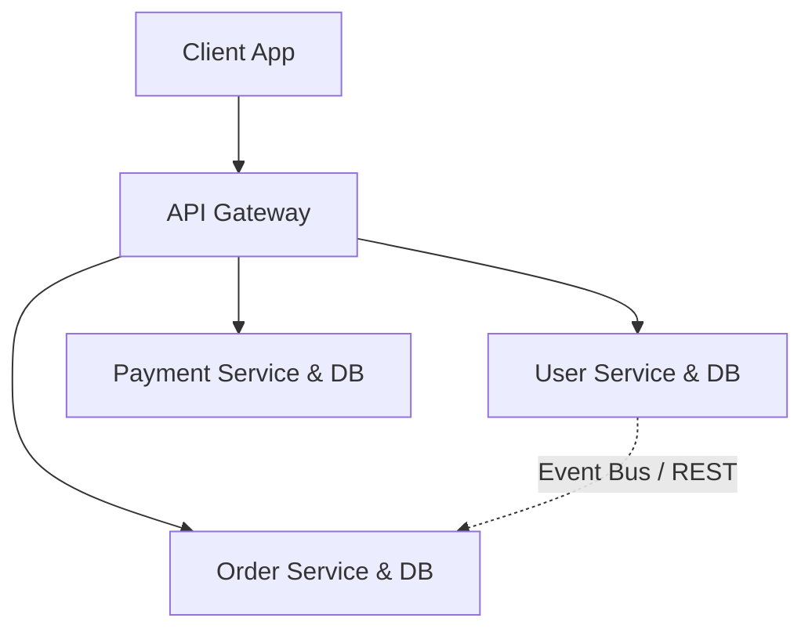
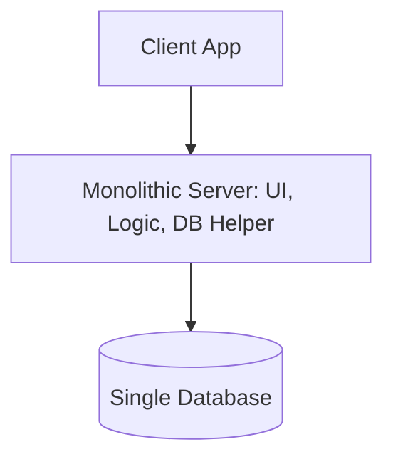
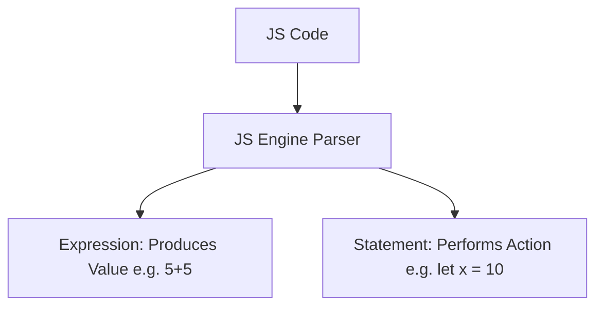

# React Masterclass: Hooks, State, and Data Fetching

এই ফাইলটিতে React-এর অত্যন্ত গুরুত্বপূর্ণ কিছু ধারণাকে গভীর আলোচনা করা হয়েছে। প্রতিটি টপিক ১৭-পয়েন্ট কাঠামোর মাধ্যমে বিস্তারিতভাবে ব্যাখ্যা করা হয়েছে যাতে আপনার কনসেপ্ট একদম ক্লিয়ার হয়ে যায়।

---

## সূচিপত্র (Table of Contents)
1. [What are React Hooks?](#1-what-are-react-hooks)
2. [Why do we need useState Hook?](#2-why-do-we-need-usestate-hook)
3. [What is Microservice?](#3-what-is-microservice)
4. [What is Monolith architecture?](#4-what-is-monolith-architecture)
5. [What is the difference between Monolith and Microservice?](#5-what-is-the-difference-between-monolith-and-microservice)
6. [Why do we need a useEffect Hook?](#6-why-do-we-need-a-useeffect-hook)
7. [What is Optional Chaining?](#7-what-is-optional-chaining)
8. [What is Shimmer UI?](#8-what-is-shimmer-ui)
9. [What is the difference between JS expression and JS statement?](#9-what-is-the-difference-between-js-expression-and-js-statement)
10. [What is Conditional Rendering? explain with a code example.](#10-what-is-conditional-rendering-explain-with-a-code-example)

---

## 1. What are React Hooks?

### ১. সহজ সংজ্ঞা (Simple Definition)
React Hooks হল বিশেষ ধরনের বিল্ট-ইন ফাংশন যা React 16.8 ভার্সনে নিয়ে আসা হয়েছে। এগুলো ব্যবহার করে ডেভেলপাররা Class Component না লিখে শুধুমাত্র Functional Component-এর ভেতরেই state এবং অন্যান্য advanced features (যেমন lifecycle methods, context ইত্যাদি) ব্যবহার করতে পারেন।

### ২. কেন এই কনসেপ্টটি তৈরি হয়েছে (Why this concept exists)
আগে React-এ state বা lifecycle মেথড (যেমন `componentDidMount`, `componentWillUnmount`) ব্যবহার করতে হলে বাধ্যতামূলকভাবে Class Component ব্যবহার করতে হতো। কিন্তু Class Component-এর নিজস্ব কিছু জটিলতা রয়েছে, যেমন `this` কি-ওয়ার্ডের জটিল আচরণ, কোড রিইউজ করার কঠিন পদ্ধতি (HOC বা Render Props ব্যবহার করতে হতো), এবং বড় বড় কম্পোনেন্ট মেইনটেইন করা অত্যন্ত কষ্টকর ছিল। Functional Component ছিল খুবই লাইটওয়েট ও রিডঅ্যাবল, কিন্তু তাতে স্টেট ধরে রাখার কোনো উপায় ছিল না। Functional Component-কে পূর্ণাঙ্গ ক্ষমতা দেওয়ার জন্যই Hooks-এর সৃষ্টি।

### ৩. এটি কী সমস্যার সমাধান করে (What problem it solves)
* **`this` Keyword-এর জটিলতা দূরীকরণ:** জাভাস্ক্রিপ্টে `this` কীভাবে বাইন্ড করতে হয় বা এর স্কোপ কী তা নিয়ে নতুনদের অনেক সমস্যা হতো। Hooks ব্যবহারের ফলে Functional Component-এ `this`-এর কোনো প্রয়োজনই নেই।
* **কোড রিইউজেবিলিটি (Logic Reuse):** আগে দুটি কম্পোনেন্টের মধ্যে একই স্টেট লজিক শেয়ার করতে চাইলে Higher-Order Components (HOC) বা Render Props ব্যবহার করতে হতো, যা কোডবেসকে জটিল করে তুলত (Wrapper Hell)। Hooks-এর মাধ্যমে কাস্টম হুক (Custom Hooks) তৈরি করে সহজেই স্টেট লজিক রিইউজ করা যায়।
* **কম্পোনেন্ট সাইজ কমানো:** Class Component-এর তুলনায় Hooks ব্যবহার করা Functional Component-এর কোড অনেক ছোট এবং পরিষ্কার হয়।

### ৪. বাস্তব জীবনের সাথে তুলনা (Real-life analogy)
মনে করুন আপনার কাছে একটি সাধারণ সাইকেল (Functional Component) আছে। সাইকেলটি হালকা এবং চালাতে সহজ, কিন্তু এটি একা একা চলতে পারে না। আপনি যদি সাইকেলটিতে একটি ছোট রিচার্জেবল মোটর এবং ব্যাটারি (Hooks) প্লাগ-ইন করেন, তবে সাইকেলটি একটি ইলেকট্রিক বাইকের মতো ক্ষমতা পেয়ে যাবে। এখানে মোটরটি হল Hook, যা সাইকেলের মূল কাঠামো পরিবর্তন না করেই তাকে অতিরিক্ত ক্ষমতা (State/Lifecycle) দিচ্ছে।

### ৫. React কীভাবে অভ্যন্তরীণভাবে কাজ করে (How React works internally)
React প্রতিটি কম্পোনেন্টের জন্য একটি করে "Fiber node" তৈরি করে। যখন আমরা কোনো Functional Component-এ Hooks ব্যবহার করি, React সেই Fiber node-এর সাথে একটি সিঙ্গেল লিঙ্কড লিস্ট (Single Linked List) যুক্ত করে। প্রতিবার যখন কোনো Hook (যেমন `useState`, `useEffect`) কল করা হয়, React লিঙ্কড লিস্টে একটি নতুন নোড (Hook object) যোগ করে।
React হুকের স্টেট ট্র্যাক করার জন্য কোনো কী (key) বা নাম ব্যবহার করে না, বরং এটি শুধুমাত্র হুকের কল হওয়ার ক্রম বা অর্ডারের (Execution Order) উপর নির্ভর করে। যদি আমরা কোনো শর্তের (if condition) ভেতরে হুক কল করি এবং সেই শর্ত মিথ্যা হয়, তবে হুকের ক্রম ভেঙে যাবে এবং React ভুল স্টেটের সাথে ভুল হুক ম্যাপিং করবে। এর ফলে অ্যাপ্লিকেশন ক্র্যাশ করবে।

### ৬. সহজ উদাহরণ (Basic Example)
```jsx
import React, { useState } from 'react';

function Counter() {
  const [count, setCount] = useState(0);

  return (
    <div style={{ padding: '20px', textAlign: 'center' }}>
      <h2>React Hooks Counter</h2>
      <p>Current Count: {count}</p>
      <button onClick={() => setCount(count + 1)}>Increment</button>
    </div>
  );
}

export default Counter;
```

### ৭. কোডের ধাপ-বাই-ধাপ ব্যাখ্যা (Step-by-step explanation)
* `import React, { useState } from 'react';` - প্রথমে React লাইব্রেরি থেকে `useState` নামক হুকটিকে ইম্পোর্ট করা হয়েছে।
* `const [count, setCount] = useState(0);` - এটি একটি অ্যারে ডিস্ট্রাকচারিং। `useState(0)` কল করার মাধ্যমে আমরা ইনিশিয়াল স্টেট হিসেবে `0` দিয়েছি। এটি আমাদের দুটি জিনিস রিটার্ন করে:
  * `count`: কারেন্ট স্টেট ভ্যালু।
  * `setCount`: স্টেট আপডেট করার ফাংশন।
* `onClick={() => setCount(count + 1)}` - বাটনে ক্লিক করলে `setCount` ফাংশনটি কল হয় এবং কারেন্ট কাউন্ট ১ বাড়িয়ে দেয়। স্টেট পরিবর্তন হওয়ার সাথে সাথে React কম্পোনেন্টটিকে রি-রেন্ডার করে এবং নতুন ভ্যালু স্ক্রিনে দেখায়।

### ৮. আরেকটি বাস্তব উদাহরণ (Another real-world example)
ইন্টারনেট কানেকশন চেক করার জন্য একটি কাস্টম হুক:
```jsx
import { useState, useEffect } from 'react';

function useOnlineStatus() {
  const [isOnline, setIsOnline] = useState(navigator.onLine);

  useEffect(() => {
    const handleOnline = () => setIsOnline(true);
    const handleOffline = () => setIsOnline(false);

    window.addEventListener('online', handleOnline);
    window.addEventListener('offline', handleOffline);

    return () => {
      window.removeEventListener('online', handleOnline);
      window.removeEventListener('offline', handleOffline);
    };
  }, []);

  return isOnline;
}
```

### ৯. নতুনরা সাধারণত যে ভুলগুলো করে (Common mistakes beginners make)
* **শর্তের ভেতরে হুক ব্যবহার করা:** `if (condition) { useState(...) }` - এটি সম্পূর্ণ নিষিদ্ধ। কারণ এটি রেন্ডার অর্ডারের ক্ষতি করে।
* **নরমাল ফাংশনে হুক কল করা:** হুক শুধুমাত্র React Functional Component অথবা Custom Hook-এর ভেতরেই কল করা উচিত।
* **Custom Hook-এর নামে `use` প্রিফিক্স না দেওয়া:** কাস্টম হুকের নাম অবশ্যই `use` দিয়ে শুরু হতে হবে (যেমন `useAuth`), তা না হলে React-এর লিন্টার রুলস (Rules of Hooks) এটি ধরতে পারবে না।

### ১০. ইন্টারভিউ প্রশ্ন ও উত্তর (Interview questions related to this topic)
* **প্রশ্ন:** Rules of Hooks বলতে কী বোঝায়?
  * **উত্তর:** ১. হুক সবসময় কম্পোনেন্টের একদম টপ-লেভেলে কল করতে হবে (লুপ, কন্ডিশন বা নেস্টেড ফাংশনে কল করা যাবে না)। ২. হুক শুধুমাত্র React Functional Component অথবা Custom Hook থেকে কল করা যাবে।
* **প্রশ্ন:** React কীভাবে ট্র্যাক করে কোন `useState` কোন ভেরিয়েবলের জন্য?
  * **উত্তর:** React প্রতিটি কম্পোনেন্টের জন্য একটি লিঙ্কড লিস্ট মেইনটেইন করে। হুকগুলো যে অর্ডারে ডিক্লেয়ার করা হয়, React ঠিক সেই অর্ডার অনুযায়ী লিঙ্কড লিস্টের নোডগুলো রিড করে স্টেট ট্র্যাক করে।

### ১১. সেরা অনুশীলনসমূহ (Best practices)
* সবসময় ESLint-এর `eslint-plugin-react-hooks` প্লাগইনটি ব্যবহার করুন যা নিয়মের লঙ্ঘন হলে সতর্ক করবে।
* জটিল স্টেট লজিককে সবসময় কাস্টম হুকে রূপান্তর করুন যাতে কোড পরিষ্কার ও সহজে টেস্ট করা যায়।

### ১২. পারফরম্যান্স বিবেচনা (Performance considerations)
* হুকের ভেতরে অপ্রয়োজনীয় জটিল ক্যালকুলেশন এড়াতে `useMemo` বা `useCallback` ব্যবহার করুন।

### ১৩. কখন এটি ব্যবহার করা উচিত নয় (When NOT to use it)
* যদি কোনো লজিকের সাথে স্টেটের বা রেন্ডারিংয়ের সম্পর্ক না থাকে (যেমন সাধারণ গাণিতিক হিসাব বা ডেটা ফরম্যাটিং), তবে সাধারণ জাভাস্ক্রিপ্ট ফাংশন ব্যবহার করাই শ্রেয়, হুক ব্যবহার করার প্রয়োজন নেই।

### ১৪. অনুরূপ কনসেপ্টের সাথে তুলনা (Comparison with similar concepts)
* **Hooks vs Class Component:** Class Component-এ কোড লজিক বিভিন্ন লাইফসাইকেল মেথডে (যেমন Mount, Update, Unmount) বিভক্ত থাকে, যা কোড এলোমেলো করে ফেলে। হুকের মাধ্যমে রিলেটেড লজিকগুলো একসাথে রাখা যায়।

### ১৫. সহজ বাংলায় সারসংক্ষেপ (Summary in simple Bangla)
Hooks হল ফাংশনাল কম্পোনেন্টে স্টেট এবং লাইফসাইকেল ব্যবহারের এক জাদুকরী উপায়। এটি আমাদের কোডকে সহজ, রিইউজেবল এবং বাগ-মুক্ত রাখতে সাহায্য করে।

### ১৬. ৫টি MCQ (5 MCQ questions)
1. React Hooks কোন ভার্সনে প্রথম পরিচিত করা হয়?
   * A) 16.0
   * B) 16.8
   * C) 17.0
   * D) 18.2
   * **উত্তর:** B
   * **ব্যাখ্যা:** React 16.8 ভার্সনে প্রথম অফিসিয়ালি Hooks রিলিজ করা হয়।
2. হুক কল করার ক্ষেত্রে কোনটি সঠিক?
   * A) লুপের ভেতরে কল করা যাবে।
   * B) কন্ডিশনের ভেতরে কল করা যাবে।
   * C) শুধুমাত্র টপ-লেভেলে কল করতে হবে
   * D) সাধারণ জাভাস্ক্রিপ্ট ক্লাসের ভেতরে কল করা যাবে।
   * **উত্তর:** C
   * **ব্যাখ্যা:** Rules of Hooks অনুযায়ী হুক সবসময় টপ-লেভেলে ডিক্লেয়ার করতে হয়।
3. Custom Hook-এর নামের শুরুতে কী থাকা বাধ্যতামূলক?
   * A) custom
   * B) hook
   * C) use
   * D) get
   * **উত্তর:** C
   * **ব্যাখ্যা:** কাস্টম হুকের নাম অবশ্যই 'use' দিয়ে শুরু হতে হবে।
4. React অভ্যন্তরীণভাবে কীভাবে হুকের স্টেট মনে রাখে?
   * A) Key-Value pair হিসেবে
   * B) Linked List এবং Call Order-এর মাধ্যমে
   * C) Random Access Memory-তে
   * D) LocalStorage-এ
   * **উত্তর:** B
   * **ব্যাখ্যা:** React রেন্ডার অর্ডারের ওপর ভিত্তি করে লিঙ্কড লিস্টের সাহায্যে হুক ট্র্যাক করে।
5. নিচের কোনটি একটি বিল্ট-ইন React Hook নয়?
   * A) useState
   * B) useEffect
   * C) fetchState
   * D) useContext
   * **উত্তর:** C
   * **ব্যাখ্যা:** fetchState নামের কোনো হুক React-এ নেই।

### ১৭. ৫টি কোডিং অনুশীলন ও সমাধান (5 Coding exercises)
* **অনুশীলন ১:** একটি `useToggle` কাস্টম হুক তৈরি করুন যা true/false স্টেট টগল করবে।
  ```javascript
  import { useState } from 'react';
  export function useToggle(initialValue = false) {
    const [value, setValue] = useState(initialValue);
    const toggle = () => setValue(prev => !prev);
    return [value, toggle];
  }
  ```
* **অনুশীলন ২:** একটি input ফিল্ডের ভ্যালু ট্র্যাক করার জন্য `useInput` কাস্টম হুক লিখুন।
  ```javascript
  import { useState } from 'react';
  export function useInput(initialValue = '') {
    const [value, setValue] = useState(initialValue);
    const onChange = (e) => setValue(e.target.value);
    return { value, onChange };
  }
  ```
* **অনুশীলন ৩:** উইন্ডোর উইডথ (width) ট্র্যাক করার জন্য একটি `useWindowWidth` কাস্টম হুক তৈরি করুন।
  ```javascript
  import { useState, useEffect } from 'react';
  export function useWindowWidth() {
    const [width, setWidth] = useState(window.innerWidth);
    useEffect(() => {
      const handleResize = () => setWidth(window.innerWidth);
      window.addEventListener('resize', handleResize);
      return () => window.removeEventListener('resize', handleResize);
    }, []);
    return width;
  }
  ```
* **অনুশীলন ৪:** একটি কাস্টম হুক `useDocumentTitle` লিখুন যা ডাইনামিকভাবে ডকুমেন্টের টাইটেল আপডেট করবে।
  ```javascript
  import { useEffect } from 'react';
  export function useDocumentTitle(title) {
    useEffect(() => {
      document.title = title;
    }, [title]);
  }
  ```
* **অনুশীলন ৫:** কাস্টম হুক `useLocalStorage` তৈরি করুন যা লোকাল স্টোরেজে ডেটা সেভ ও রিড করবে।
  ```javascript
  import { useState } from 'react';
  export function useLocalStorage(key, initialValue) {
    const [storedValue, setStoredValue] = useState(() => {
      try {
        const item = window.localStorage.getItem(key);
        return item ? JSON.parse(item) : initialValue;
      } catch (error) {
        return initialValue;
      }
    });
    const setValue = (value) => {
      try {
        const valueToStore = value instanceof Function ? value(storedValue) : value;
        setStoredValue(valueToStore);
        window.localStorage.setItem(key, JSON.stringify(valueToStore));
      } catch (error) {
        console.log(error);
      }
    };
    return [storedValue, setValue];
  }
  ```

---

## 2. Why do we need useState Hook?

### ১. সহজ সংজ্ঞা (Simple Definition)
`useState` হল React-এর একটি বিল্ট-ইন হুক যা ফাংশনাল কম্পোনেন্টে স্টেট (State) যুক্ত করতে ব্যবহৃত হয়। স্টেট হল একটি বিশেষ অবজেক্ট বা ডেটা স্টোরেজ যা কম্পোনেন্টের নিজস্ব ডাইনামিক ডেটা ধারণ করে।

### ২. কেন এই কনসেপ্টটি তৈরি হয়েছে (Why this concept exists)
React-এ সাধারণ লোকাল ভেরিয়েবল (যেমন `let counter = 0`) পরিবর্তন করলে কম্পোনেন্ট পুনরায় রেন্ডার বা রি-রেন্ডার (Re-render) হয় না। ফলে ভেরিয়েবলের ডেটা পরিবর্তন হলেও ব্রাউজারে বা UI-তে কোনো পরিবর্তন দেখা যায় না। কম্পোনেন্টের ডেটা পরিবর্তনের সাথে সাথে যাতে UI-ও স্বয়ংক্রিয়ভাবে আপডেট হয়, সেই জন্য `useState` হুক তৈরি করা হয়েছে।

### ৩. এটি কী সমস্যার সমাধান করে (What problem it solves)
* **ডেটা এবং UI-এর সিঙ্ক্রোনাইজেশন:** এটি নিশ্চিত করে যে যখনই কোনো ডেটা আপডেট হবে, React স্বয়ংক্রিয়ভাবে কম্পোনেন্ট রি-রেন্ডার করে UI আপডেট করে দেবে।
* **রেন্ডারের মধ্যে ডেটা বজায় রাখা:** সাধারণ ভেরিয়েবল প্রতিবার রেন্ডার হওয়ার সময় রিসেট হয়ে যায়। কিন্তু `useState` রেন্ডারের মধ্যবর্তী সময়েও স্টেটের পূর্ববর্তী ভ্যালু মনে রাখে।

### ৪. বাস্তব জীবনের সাথে তুলনা (Real-life analogy)
একটি ক্রিকেট ম্যাচের স্কোরবোর্ড এবং একজন সাধারণ দর্শকের খাতা। দর্শক যদি খাতায় রান আপডেট করেন, তবে মাঠে বসে থাকা বাকি দর্শকরা তা দেখতে পান না (সাধারণ ভেরিয়েবল)। কিন্তু যদি ডিজিটাল স্কোরবোর্ডে (useState) রান আপডেট করা হয়, তবে পুরো স্টেডিয়ামের মানুষ সাথে সাথে তা দেখতে পায় (UI Re-render)।

### ৫. React কীভাবে অভ্যন্তরীণভাবে কাজ করে (How React works internally)
যখন `useState` কল করা হয়, React তার ফাইবার ট্রির নির্দিষ্ট নোডে এই স্টেটের মান সংরক্ষণ করে। যখন স্টেট আপডেট করার জন্য setter ফাংশন (যেমন `setCount`) কল করা হয়:
1. React একটি নতুন রেন্ডারিং ট্রিপ শিডিউল করে।
2. React নতুন মানটিকে আগের মানের সাথে তুলনা করে (Object.is অ্যালগরিদম ব্যবহার করে)।
3. যদি মান পরিবর্তিত হয়, তবে কম্পোনেন্টটি রি-রেন্ডার হয় এবং নতুন ভার্চুয়াল ডম (Virtual DOM) তৈরি করে।
4. Reconciliation প্রসেসের মাধ্যমে শুধুমাত্র পরিবর্তিত অংশটুকু ব্রাউজারের আসল ডমে (Real DOM) আপডেট করা হয়।

### ৬. সহজ উদাহরণ (Basic Example)
```jsx
import React, { useState } from 'react';

function ToggleMessage() {
  const [isVisible, setIsVisible] = useState(false);

  return (
    <div style={{ margin: '20px' }}>
      <button onClick={() => setIsVisible(!isVisible)}>
        {isVisible ? 'Hide' : 'Show'} Message
      </button>
      {isVisible && <p>Hello! Welcome to React Masterclass.</p>}
    </div>
  );
}

export default ToggleMessage;
```

### ৭. কোডের ধাপ-বাই-ধাপ ব্যাখ্যা (Step-by-step explanation)
* `const [isVisible, setIsVisible] = useState(false);` - এখানে `false` হল ইনিশিয়াল স্টেট। `isVisible` ভেরিয়েবলটি স্টেটের বর্তমান অবস্থা ধরে রাখে এবং `setIsVisible` ফাংশনটি সেই অবস্থা পরিবর্তন করতে সাহায্য করে।
* `onClick={() => setIsVisible(!isVisible)}` - বাটনে ক্লিক করলে `setIsVisible` ফাংশনটি কল হবে এবং স্টেটের বর্তমান মান টগল (toggle) করবে (true থাকলে false এবং false থাকলে true)।
* `{isVisible && <p>...</p>}` - এটি একটি Conditional Rendering। `isVisible` যদি `true` হয়, তবেই টেক্সটটি স্ক্রিনে দেখা যাবে।

### ৮. আরেকটি বাস্তব উদাহরণ (Another real-world example)
ইউজার প্রোফাইল এডিট করার জন্য ইনপুট ফিল্ড ডিক্লেয়ার করা:
```jsx
import React, { useState } from 'react';

function UserProfile() {
  const [username, setUsername] = useState('Rohit');

  return (
    <div>
      <h3>User Profile: {username}</h3>
      <input 
        type="text" 
        value={username} 
        onChange={(e) => setUsername(e.target.value)} 
      />
    </div>
  );
}
```

### ৯. নতুনরা সাধারণত যে ভুলগুলো করে (Common mistakes beginners make)
* **স্টেট সরাসরি পরিবর্তন করা:** `state = newValue` - এটি React ডিটেক্ট করতে পারে না। সবসময় setter ফাংশন ব্যবহার করতে হবে (যেমন `setState(newValue)`)।
* **স্টেট আপডেটের সাথে সাথে ভ্যালু রিড করার চেষ্টা:** স্টেট আপডেট অ্যাসিনক্রোনাস (Asynchronous) হতে পারে। তাই `setCount(count + 1)` ডাকার ঠিক পরের লাইনে `console.log(count)` করলে আগের ভ্যালুটাই দেখাবে।
* **পূর্ববর্তী স্টেটের ওপর নির্ভর করার সময় ভুল ফাংশন কল:** যখন নতুন স্টেট পূর্ববর্তী স্টেটের ওপর নির্ভরশীল থাকে, তখন সরাসরি ভ্যালু পাস না করে ফাংশনাল আপডেট প্যাটার্ন ব্যবহার করা উচিত: `setCount(prevCount => prevCount + 1)`।

### ১০. ইন্টারভিউ প্রশ্ন ও উত্তর (Interview questions related to this topic)
* **প্রশ্ন:** React-এ স্টেট আপডেট কি সিনক্রোনাস নাকি অ্যাসিনক্রোনাস?
  * **উত্তর:** স্টেট আপডেট সাধারণত অ্যাসিনক্রোনাস বা ব্যাচড (Batched) হয়ে থাকে। পারফরম্যান্স অপ্টিমাইজেশনের জন্য React একের অধিক স্টেট আপডেটকে একসাথে নিয়ে একক রেন্ডারে সম্পন্ন করে।
* **প্রশ্ন:** `useState` এবং সাধারণ লোকাল ভেরিয়েবলের মধ্যে পার্থক্য কী?
  * **উত্তর:** সাধারণ লোকাল ভেরিয়েবল পরিবর্তন হলে UI আপডেট হয় না এবং রি-রেন্ডার হলে রিসেট হয়ে যায়। কিন্তু `useState` পরিবর্তন হলে UI রি-রেন্ডার হয় এবং রি-রেন্ডার হলেও এর ডেটা টিকে থাকে।

### ১১. সেরা অনুশীলনসমূহ (Best practices)
* স্টেটকে সবসময় যত সম্ভব মিনিমাল (Minimal) রাখুন। অন্য কোনো স্টেট থেকে যদি কোনো ডেটা ক্যালকুলেট করা যায়, তবে তার জন্য আলাদা স্টেট ডিক্লেয়ার করবেন না।
* স্টেট আপডেট করার সময় ইমিউটেবিলিটি (Immutability) বজায় রাখুন (বিশেষ করে অবজেক্ট ও অ্যারের ক্ষেত্রে নতুন রেফারেন্স তৈরি করুন)।

### ১২. পারফরম্যান্স বিবেচনা (Performance considerations)
* **Lazy Initialization:** স্টেটের ইনিশিয়াল ভ্যালু যদি কোনো বড় হিসাব নিকাশ বা ফাংশন থেকে আসে, তবে সরাসরি ফাংশন কল না করে এভাবে লিখুন: `useState(() => getHeavyData())`। এতে প্রতি রেন্ডারে ফাংশনটি কল হবে না, কেবল প্রথমবার হবে।

### ১৩. কখন এটি ব্যবহার করা উচিত নয় (When NOT to use it)
* যদি কোনো ভেরিয়েবলের ডেটা পরিবর্তন হলেও UI-তে কোনো প্রভাব না পড়ে, তবে তার জন্য `useState` ব্যবহার করবেন না। সেক্ষেত্রে `useRef` হুক ব্যবহার করাই সেরা উপায়।

### 1৪. অনুরূপ কনসেপ্টের সাথে তুলনা (Comparison with similar concepts)
* **`useState` vs `useRef`:** `useState` এর পরিবর্তন রি-রেন্ডার ঘটায়, কিন্তু `useRef` এর মান পরিবর্তন হলে রি-রেন্ডার ঘটে না।

### ১৫. সহজ বাংলায় সারসংক্ষেপ (Summary in simple Bangla)
`useState` হল একটি ডেটা স্টোরেজ যা পরিবর্তন হলে React ব্রাউজারকে বলে যে UI পরিবর্তন করতে হবে। এটি ছাড়া আমরা ইন্টারঅ্যাক্টিভ ও ডাইনামিক ওয়েব অ্যাপ বানাতে পারতাম না।

### ১৬. ৫টি MCQ (5 MCQ questions)
1. `useState` হুক কী রিটার্ন করে?
   * A) শুধুমাত্র একটি স্টেট ভেরিয়েবল
   * B) একটি অবজেক্ট
   * C) দুটি উপাদানের একটি অ্যারে
   * D) একটি প্রমিজ (Promise)
   * **উত্তর:** C
   * **ব্যাখ্যা:** এটি কারেন্ট স্টেট এবং একটি আপডেট ফাংশন ধারণকারী অ্যারে রিটার্ন করে।
2. নিচের কোনটি স্টেটের সরাসরি মিউটেশন (Direct Mutation)?
   * A) setCount(count + 1)
   * B) count = count + 1
   * C) setCount(prev => prev + 1)
   * D) count = 5 (যখন count একটি স্টেট ভেরিয়েবল)
   * **উত্তর:** D
   * **ব্যাখ্যা:** স্টেট সরাসরি অ্যাসাইনমেন্ট অপারেটর দিয়ে পরিবর্তন করা নিষিদ্ধ।
3. State Lazy Initialization কখন ব্যবহার করা উচিত?
   * A) প্রতিবার রেন্ডার করানোর জন্য
   * B) জটিল বা ভারী হিসাব-নিকাশ এড়ানোর জন্য প্রথম রেন্ডারে
   * C) ডেটাবেস থেকে ডেটা আনার জন্য
   * D) কোনো কম্পোনেন্ট আনমাউন্ট করার জন্য
   * **উত্তর:** B
   * **ব্যাখ্যা:** জটিল কাজ শুধুমাত্র একবার চালানোর জন্য স্টেট ইনিশিয়ালাইজেশনে অ্যারো ফাংশন ব্যবহার করা হয়।
4. React-এ State update করার পর তাৎক্ষণিক নতুন মান কনসোলে না পাওয়ার কারণ কী?
   * A) স্টেট আপডেট সিনক্রোনাস
   * B) স্টেট আপডেট অ্যাসিনক্রোনাস এবং ব্যাচড
   * C) কনসোল লগ কাজ করে না
   * D) জাভাস্ক্রিপ্ট স্লো
   * **উত্তর:** B
   * **ব্যাখ্যা:** React একবারে সব স্টেট আপডেট প্রসেস করে রেন্ডারের পরে মান আপডেট করে।
5. UI-তে কোনো প্রভাব ফেলে না এমন ডেটার জন্য কোনটি ব্যবহার করা উচিত?
   * A) useState
   * B) useRef
   * C) useEffect
   * D) useContext
   * **উত্তর:** B
   * **ব্যাখ্যা:** রেন্ডার ট্রিগার না করে ডেটা স্টোর করতে `useRef` সবচেয়ে উপযুক্ত।

### ১৭. ৫টি কোডিং অনুশীলন ও সমাধান (5 Coding exercises)
* **অনুশীলন ১:** একটি কম্পোনেন্ট লিখুন যেখানে একটি বাটন ক্লিক করলে ব্যাকগ্রাউন্ড কালার লাল এবং সবুজ কালারের মধ্যে পরিবর্তন হবে।
  ```jsx
  import React, { useState } from 'react';
  export function ColorToggle() {
    const [color, setColor] = useState('red');
    return (
      <div style={{ backgroundColor: color, padding: '20px' }}>
        <button onClick={() => setColor(color === 'red' ? 'green' : 'red')}>
          Change Color
        </button>
      </div>
    );
  }
  ```
* **অনুশীলন ২:** একটি টেক্সট এরিয়া তৈরি করুন যা ইউজারের টাইপ করা অক্ষরের সংখ্যা লাইভ কাউন্ট করবে।
  ```jsx
  import React, { useState } from 'react';
  export function CharacterCounter() {
    const [text, setText] = useState('');
    return (
      <div>
        <textarea onChange={(e) => setText(e.target.value)} value={text} />
        <p>Character count: {text.length}</p>
      </div>
    );
  }
  ```
* **অনুশীলন ৩:** একটি কার্ট আইটেম কাউন্টার তৈরি করুন যেখানে প্লাস ক্লিক করলে সংখ্যা বাড়বে এবং মাইনাস ক্লিক করলে কমবে (তবে ০-এর নিচে নামবে না)।
  ```jsx
  import React, { useState } from 'react';
  export function CartCounter() {
    const [count, setCount] = useState(0);
    return (
      <div>
        <button onClick={() => setCount(prev => Math.max(0, prev - 1))}>-</button>
        <span>{count}</span>
        <button onClick={() => setCount(prev => prev + 1)}>+</button>
      </div>
    );
  }
  ```
* **অনুশীলন ৪:** একাধিক ইনপুট ফিল্ড (First Name এবং Last Name) হ্যান্ডেল করার জন্য একটি সিঙ্গেল অবজেক্ট স্টেট ব্যবহার করে কম্পোনেন্ট তৈরি করুন।
  ```jsx
  import React, { useState } from 'react';
  export function NameForm() {
    const [name, setName] = useState({ firstName: '', lastName: '' });
    return (
      <div>
        <input 
          type="text" 
          placeholder="First Name"
          value={name.firstName}
          onChange={(e) => setName({ ...name, firstName: e.target.value })}
        />
        <input 
          type="text" 
          placeholder="Last Name"
          value={name.lastName}
          onChange={(e) => setName({ ...name, lastName: e.target.value })}
        />
        <p>Full Name: {name.firstName} {name.lastName}</p>
      </div>
    );
  }
  ```
* **অনুশীলন ৫:** একটি টু-ডু লিস্টের আইটেম অ্যাড করার ফাংশনালিটি তৈরি করুন (useState অ্যারে ব্যবহার করে)।
  ```jsx
  import React, { useState } from 'react';
  export function TodoList() {
    const [todos, setTodos] = useState([]);
    const [input, setInput] = useState('');
    const addTodo = () => {
      if (input.trim() !== '') {
        setTodos([...todos, input]);
        setInput('');
      }
    };
    return (
      <div>
        <input value={input} onChange={(e) => setInput(e.target.value)} />
        <button onClick={addTodo}>Add Todo</button>
        <ul>
          {todos.map((todo, index) => <li key={index}>{todo}</li>)}
        </ul>
      </div>
    );
  }
  ```

---

## 3. What is Microservice?

### ১. সহজ সংজ্ঞা (Simple Definition)
Microservice হল এমন একটি সফটওয়্যার আর্কিটেকচারাল ডিজাইন যেখানে একটি বড় এবং জটিল সফটওয়্যার অ্যাপ্লিকেশনকে অনেকগুলো ছোট, স্বাধীন ও স্বয়ংসম্পূর্ণ সার্ভিসে (Service) ভাগ করা হয়। প্রতিটি সার্ভিস আলাদা আলাদা বিজনেস লজিক হ্যান্ডেল করে এবং নিজেদের মধ্যে হালকা নেটওয়ার্ক প্রোটোকলের (যেমন HTTP REST API বা gRPC) মাধ্যমে কথা বলে।

### ২. কেন এই কনসেপ্টটি তৈরি হয়েছে (Why this concept exists)
বড় বড় কোডবেস যখন হাজার হাজার লাইনে পৌঁছায়, তখন পুরো অ্যাপ্লিকেশনটি একসাথে ম্যানেজ করা কঠিন হয়ে যায়। কোনো নির্দিষ্ট ফিচার আপডেট করতে চাইলে পুরো সিস্টেম টেস্ট ও ডেপ্লয় করতে হতো। টিমের সদস্যরা কোড মার্জ করতে গিয়ে কনফ্লিক্ট ফেস করত। এই কর্মদক্ষতা ও রক্ষণাবেক্ষণের সীমাবদ্ধতা দূর করতেই মাইক্রোসার্ভিস ধারণার উৎপত্তি।

### ৩. এটি কী সমস্যার সমাধান করে (What problem it solves)
* **স্বাধীন স্কেলিং (Independent Scaling):** যদি আপনার অ্যাপ্লিকেশনের পেমেন্ট সিস্টেমের ওপর লোড বাড়ে, তবে শুধু পেমেন্ট সার্ভিসটিকে স্কেল করলেই হয়, পুরো অ্যাপ্লিকেশনটি স্কেল করতে হয় না।
* **প্রযুক্তির স্বাধীনতা (Technology Stack Freedom):** একটি সার্ভিস হয়তো Python দিয়ে ডেটা সায়েন্সের জন্য লেখা হতে পারে, অন্য একটি সার্ভিস NodeJS দিয়ে রিয়েল-টাইম চ্যাটের জন্য ব্যবহার করা হতে পারে।
* **ফল্ট টলারেন্স (Fault Tolerance):** একটি সার্ভিস ডাউন হলে পুরো ওয়েবসাইট ক্র্যাশ করে না। যেমন: নেটফ্লিক্সের রিকমেন্ডেশন সিস্টেম কাজ না করলেও ভিডিও দেখার মেইন সার্ভিস চালু থাকে।

### ৪. বাস্তব জীবনের সাথে তুলনা (Real-life analogy)
একটি বড় শপিং মলের ভেতরের দোকানগুলোর মতো। সেখানে জুতো বিক্রির দোকান, কাপড়ের দোকান এবং ফুড কোর্ট আলাদা। প্রতিটি দোকান সম্পূর্ণ আলাদা মালিকানা ও স্টাফ দিয়ে চলে। কাপড়ের দোকান যদি কোনো কারণে বন্ধ থাকে, তবে ফুড কোর্টের বিক্রি বন্ধ হয় না। তারা স্বাধীনভাবে কাজ করে কিন্তু একই শপিং মলের অংশ।

### ৫. আর্কিটেকচার কীভাবে কাজ করে (How Microservices Architecture works)
মাইক্রোসার্ভিস সিস্টেমে ক্লায়েন্ট সরাসরি সব সার্ভিসে হিট করে না। এর জন্য কিছু গুরুত্বপূর্ণ কম্পোনেন্ট থাকে:
1. **API Gateway:** এটি সমস্ত রিকোয়েস্টের প্রবেশদ্বার হিসেবে কাজ করে এবং রিকোয়েস্টটি কোন সার্ভিসের কাছে যাবে তা রাউট করে।
2. **Service Discovery:** কোন সার্ভিস কোন আইপি ঠিকানায় এবং পোর্টে চলছে তা খুঁজে বের করতে এটি কাজ করে।
3. **Decentralized Database:** প্রতিটি সার্ভিসের নিজস্ব ডেটাবেস থাকে। পেমেন্ট সার্ভিস ইউজার সার্ভিসের ডেটাবেসে সরাসরি অ্যাক্সেস করতে পারে না, তাকে API-এর মাধ্যমে রিকোয়েস্ট করতে হয়।
4. **Event Bus/Message Broker:** সার্ভিসগুলোর মধ্যে অ্যাসিনক্রোনাস যোগাযোগের জন্য RabbitMQ বা Apache Kafka ব্যবহার করা হয়।



### ৬. সহজ উদাহরণ (Basic Example)
এখানে দুটি আলাদা এক্সপ্রেস সার্ভারের ধারণা দেখানো হল যা মাইক্রোসার্ভিস আকারে নিজেদের মধ্যে API কলের মাধ্যমে যুক্ত থাকে।

**User Service (Port 4000):**
```javascript
const express = require('express');
const app = express();

app.get('/users/:id', (req, res) => {
  const users = {
    1: { id: 1, name: 'Rohit', email: 'rohit@example.com' }
  };
  res.json(users[req.params.id] || { error: 'User not found' });
});

app.listen(4000, () => console.log('User Service running on port 4000'));
```

**Order Service (Port 5000) যা User Service-কে নেটওয়ার্কের মাধ্যমে কল করে:**
```javascript
const express = require('express');
const axios = require('axios');
const app = express();

app.get('/orders/:userId', async (req, res) => {
  try {
    // User Service থেকে ডেটা আনা হচ্ছে
    const userRes = await axios.get(`http://localhost:4000/users/${req.params.userId}`);
    const userData = userRes.data;

    res.json({
      orderId: 101,
      item: 'React Masterclass Course',
      buyer: userData.name
    });
  } catch (error) {
    res.status(500).json({ error: 'Failed to fetch buyer info' });
  }
});

app.listen(5000, () => console.log('Order Service running on port 5000'));
```

### ৭. কোডের ধাপ-বাই-ধাপ ব্যাখ্যা (Step-by-step explanation)
* **User Service** সম্পূর্ণ আলাদা পোর্টে (4000) চলে এবং শুধুমাত্র ইউজার ইনফরমেশন প্রদান করে।
* **Order Service** পোর্টে (5000) রান করে। যখন এটি কোনো অর্ডারের রিকোয়েস্ট পায়, তখন এটি সরাসরি ডেটাবেস জয়েন (join) করতে পারে না কারণ ইউজারের ডেটা অন্য সার্ভিসের অধীনে।
* তাই এটি `axios` ব্যবহার করে ইউজার সার্ভিসের এন্ডপয়েন্টে রিকোয়েস্ট পাঠায় এবং ডেটা নিয়ে এসে অর্ডার প্রসেস সম্পন্ন করে।

### ৮. আরেকটি বাস্তব উদাহরণ (Another real-world example)
ই-কমার্স প্ল্যাটফর্ম যেমন Amazon বা Flipkart। এখানে সার্চ ইঞ্জিন, শপিং কার্ট, পেমেন্ট গেটওয়ে, ইনভেন্টরি ট্র্যাকিং এবং নোটিফিকেশন সিস্টেমের প্রতিটি বিভাগ আলাদা আলাদা মাইক্রোসার্ভিস দ্বারা পরিচালিত হয়।

### ৯. নতুনরা সাধারণত যে ভুলগুলো করে (Common mistakes beginners make)
* **Shared Database ব্যবহার করা:** দুটি মাইক্রোসার্ভিসের মধ্যে একই ডেটাবেস শেয়ার করা মাইক্রোসার্ভিসের মূল নীতিবিরোধী।
* **খুব তাড়াতাড়ি সার্ভিস ভাঙা (Premature Decomposition):** প্রোজেক্ট শুরুর আগেই অনেক ক্ষুদ্র ক্ষুদ্র সার্ভিস (Nano-services) বানিয়ে ফেলা যা নেটওয়ার্ক ল্যাটেন্সি বাড়িয়ে দেয়।
* **নেটওয়ার্ক ফেইলিউর হ্যান্ডেল না করা:** নেটওয়ার্কের কারণে অন্য সার্ভিস ডাউন থাকতে পারে, এটি হ্যান্ডেল করতে সার্কিট ব্রেকার (Circuit Breaker) ব্যবহার না করা।

### ১০. ইন্টারভিউ প্রশ্ন ও উত্তর (Interview questions related to this topic)
* **প্রশ্ন:** "Database per Service" প্যাটার্ন বলতে কী বোঝায়?
  * **উত্তর:** প্রতিটি মাইক্রোসার্ভিসের নিজস্ব ব্যক্তিগত ডেটাবেস থাকবে এবং অন্য কোনো সার্ভিস সরাসরি সেই ডেটাবেসে অ্যাক্সেস করতে পারবে না। ডেটার প্রয়োজন হলে API বা মেসেজ কিউ-এর মাধ্যমে যোগাযোগ করতে হবে।
* **প্রশ্ন:** Saga Pattern কী?
  * **উত্তর:** ডিস্ট্রিবিউটেড মাইক্রোসার্ভিস সিস্টেমে ট্রানজেকশনাল ডেটা ইন্টিগ্রিটি বজায় রাখার জন্য Saga প্যাটার্ন ব্যবহার করা হয়, যেখানে লোকাল ট্রানজেকশনের একটি সিরিজ হিসেবে মূল ট্রানজেকশন সম্পন্ন হয়।

### ১১. সেরা অনুশীলনসমূহ (Best practices)
* প্রতিটি সার্ভিসের জন্য আলাদা CI/CD পাইপলাইন রাখুন।
* সেন্ট্রালাইজড লগিং (যেমন ELK Stack বা Grafana) এবং ডিস্ট্রিবিউটেড ট্রেসিং (যেমন Jaeger) ব্যবহার করুন।

### ১২. পারফরম্যান্স বিবেচনা (Performance considerations)
* ইন্টার-সার্ভিস কমিউনিকেশন দ্রুত করতে gRPC বা মেসেজ ব্রোকার (Kafka) ব্যবহার করুন।

### ১৩. কখন এটি ব্যবহার করা উচিত নয় (When NOT to use it)
* একদম নতুন বা ছোট স্টার্টআপ প্রোজেক্টে যেখানে ডেভেলপারের সংখ্যা কম। কারণ এটি পরিচালনা করার খরচ এবং জটিলতা অনেক বেশি।

### ১৪. অনুরূপ কনসেপ্টের সাথে তুলনা (Comparison with similar concepts)
* **Microservices vs Serverless:** Serverless-এ ইভেন্ট-ট্রিগার্ড ফাংশন থাকে যা শুধুমাত্র রান করার সময় অ্যাক্টিভ হয়, অন্যদিকে Microservice সাধারণত কন্টিনিউয়াসলি চলতে থাকা কন্টেইনার বা সার্ভার।

### ১৫. সহজ বাংলায় সারসংক্ষেপ (Summary in simple Bangla)
মাইক্রোসার্ভিস হল একটি বড় সফটওয়্যারকে ছোট ছোট টিম বা সার্ভিসে ভাগ করে চালানো যাতে সবাই স্বাধীনভাবে কাজ করতে পারে এবং একটি পার্ট ভেঙে গেলেও পুরো ওয়েবসাইট বন্ধ না হয়।

### ১৬. ৫টি MCQ (5 MCQ questions)
1. মাইক্রোসার্ভিসের প্রধান বৈশিষ্ট্য কোনটি?
   * A) একক বড় ডেটাবেস
   * B) টাইট কাপলিং (Tight Coupling)
   * C) স্বয়ংসম্পূর্ণ ও স্বাধীন ডিপ্লয়মেন্ট
   * D) শুধুমাত্র জাভাস্ক্রিপ্ট দিয়ে তৈরি হওয়া
   * **উত্তর:** C
   * **ব্যাখ্যা:** মাইক্রোসার্ভিসগুলো স্বাধীনভাবে ডেভেলপ এবং ডেপ্লয় করা যায়।
2. মাইক্রোসার্ভিস কমিউনিকেশনের জন্য সাধারণত কোনটি ব্যবহৃত হয়?
   * A) C++ Pointer
   * B) Memory Shared variable
   * C) HTTP REST APIs/gRPC
   * D) CSS Stylesheets
   * **উত্তর:** C
   * **ব্যাখ্যা:** বিভিন্ন নেটওয়ার্ক প্রোটোকল যেমন HTTP বা gRPC এর মাধ্যমে সার্ভিসগুলোর মধ্যে ডেটা ট্রান্সফার হয়।
3. API Gateway এর কাজ কী?
   * A) ডেটাবেস ব্যাকআপ নেওয়া
   * B) সমস্ত রিকোয়েস্ট রিসিভ করে নির্দিষ্ট সার্ভিসে রাউট করা
   * C) কোড কম্পাইল করা
   * D) ডম রেন্ডার করা
   * **উত্তর:** B
   * **ব্যাখ্যা:** API Gateway গেটওয়ে হিসেবে কাজ করে এবং সব ক্লায়েন্ট রিকোয়েস্ট ম্যানেজ করে।
4. একটি মাইক্রোসার্ভিস ডাউন হলে পুরো সিস্টেম সচল রাখতে সাহায্য করে কোন আর্কিটেকচারাল প্যাটার্ন?
   * A) Singleton Pattern
   * B) Circuit Breaker Pattern
   * C) MVC Pattern
   * D) Prototype Pattern
   * **উত্তর:** B
   * **ব্যাখ্যা:** Circuit Breaker প্যাটার্ন ফেইলিউরকে প্রোপাগেট হতে বাধা দেয় এবং অল্টারনেটিভ রেসপন্স দেখায়।
5. মাইক্রোসার্ভিসে "Database per Service" কেন গুরুত্বপূর্ণ?
   * A) ডেটা স্টোরেজ কেনার খরচ কমাতে
   * B) সার্ভিসগুলোর মধ্যে স্বনির্ভরতা বজায় রাখতে
   * C) ডেটাবেস ব্যাকআপ সহজ করতে
   * D) কুয়েরি স্পিড কমাতে
   * **উত্তর:** B
   * **ব্যাখ্যা:** শেয়ার্ড ডেটাবেস থাকলে একটি সার্ভিসের পরিবর্তন অন্য সার্ভিসকে নষ্ট করে দিতে পারে, তাই প্রতিটি সার্ভিসের নিজস্ব ডেটাবেস থাকে।

### ১৭. ৫টি কোডিং অনুশীলন ও সমাধান (5 Coding exercises)
* **অনুশীলন ১:** একটি কাল্পনিক API গেটওয়ের রাউটিং ফাংশন লিখুন যা রিকোয়েস্ট পাথের ওপর ভিত্তি করে সঠিক সার্ভিস URL রিটার্ন করবে।
  ```javascript
  function apiGateway(path) {
    const services = {
      '/users': 'http://localhost:4000/users',
      '/orders': 'http://localhost:5000/orders',
      '/payments': 'http://localhost:6000/payments'
    };
    const matchedKey = Object.keys(services).find(key => path.startsWith(key));
    return services[matchedKey] || 'http://localhost:3000/fallback';
  }
  console.log(apiGateway('/users/profile')); // http://localhost:4000/users
  ```
* **অনুশীলন ২:** অ্যাসিনক্রোনাস মেসেজ আদান প্রদানের একটি মক ইভেন্ট এমিটার (Event Emitter) তৈরি করুন যা অর্ডার সার্ভিসের সফল অর্ডার ক্রিয়েশন ইউজার সার্ভিসকে জানাবে।
  ```javascript
  const EventEmitter = require('events');
  const eventBus = new EventEmitter();

  // User Service Listener
  eventBus.on('OrderCreated', (data) => {
    console.log(`User Service: Incrementing order count for user ID: ${data.userId}`);
  });

  // Order Service Emits
  function createOrder(userId) {
    console.log('Order Service: Order created.');
    eventBus.emit('OrderCreated', { userId });
  }

  createOrder(12);
  ```
* **অনুশীলন ৩:** একটি নেটওয়ার্ক কল ফেইল হলে রিট্রাই (Retry) মেকানিজম সংবলিত একটি ফাংশন লিখুন।
  ```javascript
  async function fetchWithRetry(url, retries = 3) {
    for (let i = 0; i < retries; i++) {
      try {
        let response = await fetch(url);
        if (response.ok) return await response.json();
      } catch (error) {
        if (i === retries - 1) throw new Error('Failed after ' + retries + ' retries');
        console.log(`Retry ${i + 1} failed...`);
      }
    }
  }
  ```
* **অনুশীলন ৪:** একটি সিম্পল সার্ভিস হেলথ চেকআপ ফাংশন লিখুন যা বিভিন্ন সার্ভিসের পিং (Ping) স্টেট রিটার্ন করবে।
  ```javascript
  async function checkServicesHealth(serviceUrls) {
    const status = {};
    for (const [name, url] of Object.entries(serviceUrls)) {
      try {
        // Mocking ping check
        status[name] = 'Healthy';
      } catch (error) {
        status[name] = 'Unhealthy';
      }
    }
    return status;
  }
  ```
* **অনুশীলন ৫:** একটি সার্ভিস রেদিস ক্যাশে চেক করবে, না পেলে মেইন ডাটাবেস এ যাবে - এই লজিকটি ইমপ্লিমেন্ট করুন।
  ```javascript
  const mockCache = { 'user:1': 'Rohit Cache' };
  const mockDB = { 'user:1': 'Rohit DB' };

  function getUserData(userId) {
    if (mockCache[userId]) {
      console.log('Fetching from Cache...');
      return mockCache[userId];
    }
    console.log('Fetching from Database...');
    const dbValue = mockDB[userId];
    // Cache warm up
    mockCache[userId] = dbValue;
    return dbValue;
  }
  console.log(getUserData('user:1'));
  ```

---

## 4. What is Monolith architecture?

### ১. সহজ সংজ্ঞা (Simple Definition)
Monolithic Architecture হল এমন একটি সফটওয়্যার মডেল যেখানে অ্যাপ্লিকেশনের সমস্ত পার্ট বা মডিউল (ইউজার ইন্টারফেস, বিজনেস লজিক, ডেটাবেস অ্যাক্সেস) একটি একক কোডবেস এবং একক এক্সিকিউটেবল ফাইল হিসেবে তৈরি ও হোস্ট করা হয়।

### ২. কেন এই কনসেপ্টটি তৈরি হয়েছে (Why this concept exists)
সফটওয়্যার ডেভেলপমেন্টের শুরুর দিকে অ্যাপ্লিকেশন ম্যানেজ করার জটিলতা দূর করতে এই মডেল তৈরি হয়েছিল। একই সার্ভারে সমস্ত কোড থাকলে লোকাল ডেভেলপমেন্ট, টেস্টিং এবং ডিপ্লয়মেন্ট প্রক্রিয়া অত্যন্ত সহজ হয়।

### ৩. এটি কী সমস্যার সমাধান করে (What problem it solves)
* **সহজ লোকাল টেস্টিং:** কোনো নেটওয়ার্ক কল এবং ক্লাউড এনভায়রনমেন্ট সেটআপ ছাড়াই লোকালি সম্পূর্ণ অ্যাপ টেস্ট করা যায়।
* **সহজ ডিপ্লয়মেন্ট:** শুধু একটি বিল্ড ফাইল (.war, .jar, বা একটি zip ফাইল) সার্ভারে আপলোড করলেই অ্যাপ রান করে।
* **ডেটা কনসিস্টেন্সি:** সম্পূর্ণ ডেটাবেস এক জায়গায় থাকার কারণে ডেটা রিলেশনশিপ (Joins) এবং ট্রানজেকশন ম্যানেজমেন্ট (ACID properties) খুব সহজে হ্যান্ডেল করা যায়।

### ৪. বাস্তব জীবনের সাথে তুলনা (Real-life analogy)
একটি অল-ইন-ওয়ান সুইস আর্মি নাইফ (Swiss Army Knife)। একটি বডির ভেতরেই কাঁচি, ছুরি, ফাইল ও স্ক্রু ড্রাইভার একসাথে জোড়া লাগানো থাকে। সবকিছু এক জায়গায় থাকার কারণে এটি বহন করা সহজ, কিন্তু যদি ছুরির ব্লেডটি ভেঙে যায় বা ধার দিতে হয়, তবে আপনাকে পুরো ডিভাইসটিই দোকানে পাঠাতে হবে।

### ৫. আর্কিটেকচার কীভাবে কাজ করে (How Monolith works internally)
মনোলিথিক অ্যাপ্লিকেশনে সমস্ত লজিক একই মেমোরি স্পেসে রান করে। যখন কোনো রিকোয়েস্ট আসে:
1. রাউটার রিকোয়েস্টটি ধরে কন্ট্রোলারের কাছে পাঠায়।
2. কন্ট্রোলার ইন্টারনাল ফাংশন কলের মাধ্যমে বিজনেস সার্ভিসগুলো এক্সেস করে।
3. সার্ভিস সরাসরি একক ডাটাবেস কানেকশন পুলে কুয়েরি পাঠিয়ে ডেটা নিয়ে আসে।
সব কাজ একই সার্ভার প্রসেসের মধ্যে সম্পন্ন হওয়ায় কোনো নেটওয়ার্ক ল্যাটেন্সি বা অতিরিক্ত নেটওয়ার্ক ওভারহেড থাকে না।



### ৬. সহজ উদাহরণ (Basic Example)
এখানে একটি ফোল্ডার স্ট্রাকচারের মধ্যে সম্পূর্ণ অ্যাপ্লিকেশন (User, Order লজিক) একসাথে এক্সপ্রেস ফাইলে তৈরি করা হয়েছে:

```javascript
const express = require('express');
const app = express();

// Database Mock
const database = {
  users: { 1: { name: 'Rohit', role: 'admin' } },
  orders: { 101: { userId: 1, item: 'Keyboard' } }
};

// User Controller Logic
app.get('/users/:id', (req, res) => {
  res.json(database.users[req.params.id] || { error: 'Not Found' });
});

// Order Controller Logic with direct access to user relation (Internal DB Join)
app.get('/orders/:id', (req, res) => {
  const order = database.orders[req.params.id];
  if (!order) return res.status(404).json({ error: 'Order not found' });
  
  const user = database.users[order.userId];
  res.json({
    ...order,
    buyerName: user ? user.name : 'Unknown'
  });
});

app.listen(3000, () => console.log('Monolithic Server running on port 3000'));
```

### ৭. কোডের ধাপ-বাই-ধাপ ব্যাখ্যা (Step-by-step explanation)
* এই কোডে `/users` এবং `/orders` দুই ধরণের ইউজার রিকোয়েস্ট একই এক্সপ্রেস অ্যাপের মধ্যে হ্যান্ডেল করা হয়েছে।
* ডেটাবেস রিলেশনশিপ অ্যাক্সেস করা খুবই সহজ। যখন অর্ডারের সাথে বায়ারের নাম দরকার হয়, তখন সার্ভিস কোনো API বা নেটওয়ার্ক কল না করে সরাসরি মেমোরি থেকে `database.users[order.userId]` দিয়ে ডেটা তুলে আনে। এটি অত্যন্ত ফাস্ট কাজ করে।

### ৮. আরেকটি বাস্তব উদাহরণ (Another real-world example)
একটি সাধারণ ওয়ার্ডপ্রেস (WordPress) ব্লগ বা রুবি অন রেইলস (Ruby on Rails) প্রোজেক্ট। যেখানে থিম, প্লাগইন, পোস্ট ম্যানেজমেন্ট ও ডেটাবেস কোড সব এক জায়গায় থাকে এবং একই সাথে বিল্ড হয়ে রান করে।

### ৯. নতুনরা সাধারণত যে ভুলগুলো করে (Common mistakes beginners make)
* **স্প্যাগেটি কোড (Spaghetti Code) তৈরি করা:** কোনো লেয়ার না রেখে ডেটাবেসের লজিক ভিউ ফাইলে ঢুকিয়ে দেওয়া।
* **ডিপেন্ডেন্সি কাপলিং:** মডিউলগুলোর মধ্যে এতটাই শক্ত বাঁধন বা ডিপেন্ডেন্সি তৈরি করা যে একটি মডিউল চেঞ্জ করলে পুরো কোড ভেঙে যায়।

### ১০. ইন্টারভিউ প্রশ্ন ও উত্তর (Interview questions related to this topic)
* **প্রশ্ন:** মনোলিথের সবচেয়ে বড় অসুবিধা কী?
  * **উত্তর:** রিলিজ স্পিড কমে যাওয়া। কোডবেস অনেক বড় হয়ে গেলে সামান্য এডিটের জন্যও পুরো সিস্টেম রি-বিল্ড এবং রি-ডেপ্লয় করতে হয়। ফলে প্রোডাকশন রিলিজ স্লো হয়ে যায়।
* **প্রশ্ন:** Modular Monolith কী?
  * **উত্তর:** এটি এমন একটি মনোলিথিক আর্কিটেকচার যেখানে সম্পূর্ণ কোডবেস একটি প্রসেসেই চলে কিন্তু কোডগুলো ডোমেন অনুযায়ী অত্যন্ত সুসংগঠিত এবং পৃথক মডিউল হিসেবে থাকে, যাতে ভবিষ্যতে সহজে মাইক্রোসার্ভিসে রূপান্তর করা যায়।

### ১১. সেরা অনুশীলনসমূহ (Best practices)
* কোডবেসকে ডোমেন ড্রাইভেন ডিজাইন (Domain-Driven Design) অনুযায়ী ফোল্ডারে মডিউলার আকারে সাজান।
* ডিরেক্ট ক্লাস বাইন্ডিং না করে ইন্টারফেস বা সার্ভিস রিলেশন ব্যবহার করুন।

### ১২. পারফরম্যান্স বিবেচনা (Performance considerations)
* ইন্টার-সার্ভিস কমিউনিকেশনের কোনো নেটওয়ার্ক ল্যাটেন্সি না থাকায় মনোলিথ খুব দ্রুত রেসপন্স দিতে পারে। সঠিক কুয়েরি অপ্টিমাইজেশন ও মেমোরি ক্যাশিং করলে এটি অত্যন্ত উচ্চ পারফরম্যান্স দেয়।

### ১৩. কখন এটি ব্যবহার করা উচিত নয় (When NOT to use it)
* যখন অ্যাপ্লিকেশনটি অনেক বড় স্কেলে পৌঁছাবে এবং একাধিক ডেডিকেটেড টিম সমান্তরালভাবে সম্পূর্ণ ভিন্ন ভিন্ন ফিচারে কাজ করবে।

### ১৪. অনুরূপ কনসেপ্টের সাথে তুলনা (Comparison with similar concepts)
* **Monolith vs Modular Monolith:** সাধারণ মনোলিথে কোড মডিউলার থাকে না ফলে সব জগাখিচুড়ি হয়ে যায়, আর মডিউলার মনোলিথে কোডের মডিউলগুলো ক্লিয়ার বাউন্ডারি মেনে চলে যদিও একই সার্ভারে হোস্ট করা থাকে।

### ১৫. সহজ বাংলায় সারসংক্ষেপ (Summary in simple Bangla)
মনোলিথ হল একটি অল-ইন-ওয়ান বাড়ি যেখানে শোবার ঘর, রান্নাঘর সবই একসাথে থাকে। এটি ছোট পরিবারের জন্য তৈরি করা সহজ ও কম খরচের, তবে পরিবারের আকার অনেক বড় হয়ে গেলে এটি মেইনটেইন করা কঠিন হয়ে দাঁড়ায়।

### ১৬. ৫টি MCQ (5 MCQ questions)
1. Monolithic Architecture এর বড় সুবিধা কোনটি?
   * A) প্রতিটি ফিচারের জন্য আলাদা প্রোগ্রামিং ল্যাঙ্গুয়েজ ব্যবহার করা যায়।
   * B) লোকাল ডেভেলপমেন্ট এবং টেস্টিং অত্যন্ত সহজ।
   * C) সার্ভার বন্ধ হয়ে গেলেও অ্যাপ সচল থাকে।
   * D) কোনো ডেটাবেস প্রয়োজন হয় না।
   * **উত্তর:** B
   * **ব্যাখ্যা:** সব কোড এক জায়গায় থাকায় কোনো জটিল নেটওয়ার্ক আর্কিটেকচার ছাড়াই সহজে টেস্ট করা যায়।
2. মনোলিথিক অ্যাপ কীভাবে স্কেল করা হয়?
   * A) শুধু লোড বেশি থাকা মডিউলটি ডুপ্লিকেট করে।
   * B) সম্পূর্ণ অ্যাপ্লিকেশনের রিমোট ইনস্ট্যান্স ডুপ্লিকেট করে লোড ব্যালেন্সার বসিয়ে।
   * C) জাভাস্ক্রিপ্ট কোড রিমুভ করে।
   * D) কোনোভাবেই স্কেল করা যায় না।
   * **উত্তর:** B
   * **ব্যাখ্যা:** মনোলিথে আংশিক স্কেলিং সম্ভব নয়, পুরো প্রসেসটিকেই একাধিক সার্ভারে রান করিয়ে স্কেল করতে হয়।
3. Monolith অ্যাপে কীভাবে ডেটা জয়েনিং (Data Joining) করা হয়?
   * A) অন্য সার্ভিসের API কল করে।
   * B) একক ডাটাবেসে রিলেশনাল কুয়েরি (SQL Join) চালিয়ে।
   * C) ব্রাউজারের লোকাল স্টোরেজ থেকে।
   * D) প্রমিজ চেইনিং করে।
   * **উত্তর:** B
   * **ব্যাখ্যা:** ডেটাবেস একক হওয়ায় ডিরেক্ট SQL Join চালানো যায় যা খুব ফাস্ট।
4. কোড মডিউলার রেখে একটি একক সার্ভারে রান করানোর আর্কিটেকচারকে কী বলে?
   * A) Microservice
   * B) Distributed System
   * C) Modular Monolith
   * D) Serverless
   * **উত্তর:** C
   * **ব্যাখ্যা:** Modular Monolith এ কোড লজিক্যাল মডিউলে বিভক্ত থাকলেও তা সিঙ্গেল প্রসেসে ডেপ্লয় করা হয়।
5. নিচের কোনটি মনোলিথিক আর্কিটেকচারের দুর্বলতা?
   * A) কোড টেস্টিং এর জটিলতা
   * B) Single Point of Failure (একটি বাগ পুরো অ্যাপ বন্ধ করতে পারে)
   * C) হাই নেটওয়ার্ক ল্যাটেন্সি
   * D) ইনিশিয়াল সেটআপ এর অসুবিধা
   * **উত্তর:** B
   * **ব্যাখ্যা:** সমস্ত কোড এক প্রসেসে চলায় যেকোনো এক জায়গায় মেমোরি লিক বা ফাটল ধরলে পুরো অ্যাপ্লিকেশন ক্র্যাশ করে।

### ১৭. ৫টি কোডিং অনুশীলন ও সমাধান (5 Coding exercises)
* **অনুশীলন ১:** একটি মনোলিথিক এক্সপ্রেস কন্ট্রোলারে কীভাবে সরাসরি মেমোরি ক্যাশে ব্যবহার করে একই প্রোফাইল রিকোয়েস্ট অপ্টিমাইজ করবেন তার কোড লিখুন।
  ```javascript
  const cache = {};
  function getProfile(userId) {
    if (cache[userId]) return { data: cache[userId], source: 'Cache' };
    
    // database check mock
    const user = { id: userId, name: 'Rohit' };
    cache[userId] = user;
    return { data: user, source: 'DB' };
  }
  console.log(getProfile(1)); // source: DB
  console.log(getProfile(1)); // source: Cache
  ```
* **অনুশীলন ২:** মনোলিথিক আর্কিটেকচারের জন্য একটি MVC প্যাটার্নের ফোল্ডার স্ট্রাকচার রিপ্রেজেন্ট করে এমন একটি জাভাস্ক্রিপ্ট অবজেক্ট তৈরি করুন।
  ```javascript
  const projectStructure = {
    root: 'my-monolith-app',
    controllers: ['userController.js', 'orderController.js'],
    models: ['User.js', 'Order.js'],
    views: ['profile.ejs', 'dashboard.ejs'],
    config: 'database.js',
    app: 'server.js'
  };
  ```
* **অনুশীলন ৩:** একটি মডিউলার মনোলিথিক ক্লাস ইন্টারঅ্যাকশন লিখুন যেখানে অর্ডার ডোমেন ইউজার ডোমেনের মেথড সরাসরি কল করছে।
  ```javascript
  class UserService {
    getUser(id) {
      return { id, name: 'Rohit' };
    }
  }

  class OrderService {
    constructor(userService) {
      this.userService = userService;
    }
    createOrder(userId, item) {
      const user = this.userService.getUser(userId);
      return { item, buyer: user.name };
    }
  }

  const userSvc = new UserService();
  const orderSvc = new OrderService(userSvc);
  console.log(orderSvc.createOrder(1, 'Laptop'));
  ```
* **অনুশীলন ৪:** জাভাস্ক্রিপ্ট ব্যবহার করে একটি সিম্পল লগার ক্লাস লিখুন যা অ্যাপের সব ডোমেনের এরর একই ফাইলে লিখবে।
  ```javascript
  class CentralLogger {
    logError(moduleName, message) {
      console.log(`[ERROR] [Module: ${moduleName}] [Time: ${new Date().toISOString()}] -> ${message}`);
    }
  }
  const logger = new CentralLogger();
  logger.logError('Payment', 'Timeout connecting to bank gateway');
  ```
* **অনুশীলন ৫:** একটি মনোলিথ ডাটাবেসের জন্য একাধিক টেবিল রিলেশন রিপ্রেজেন্ট করতে মক ডেটা স্ট্রাকচার এবং কুয়েরি ফিল্টার ফাংশন লিখুন।
  ```javascript
  const users = [{ id: 1, name: 'Rohit' }];
  const posts = [{ id: 10, userId: 1, title: 'Learn React' }];

  function getUserWithPosts(userId) {
    const user = users.find(u => u.id === userId);
    const userPosts = posts.filter(p => p.userId === userId);
    return { ...user, posts: userPosts };
  }
  console.log(getUserWithPosts(1));
  ```

---

## 5. What is the difference between Monolith and Microservice?

### ১. সহজ সংজ্ঞা (Simple Definition)
Monolithic architecture হল একটি একক, অখণ্ড অ্যাপ্লিকেশন যেখানে সব কোড এবং লাইব্রেরি একই প্রসেসে চলে। আর Microservice architecture হল এমন একটি সিস্টেম যেখানে অ্যাপ্লিকেশনটি একাধিক ছোট, স্বাধীন সার্ভিসে বিভক্ত থাকে যা নেটওয়ার্কের মাধ্যমে যোগাযোগ করে।

### ২. কেন এই কনসেপ্টটি তৈরি হয়েছে (Why this concept exists)
অ্যাপ্লিকেশনের আকার ও টিম মেম্বার বৃদ্ধির সাথে সাথে মনোলিথের কার্যক্ষমতার সীমাবদ্ধতা দেখা দেয়। এর সমাধান খুঁজতে এবং বড় সিস্টেমে কাজের গতি ও স্বাধীনতার সমন্বয় করতে এই দুই আর্কিটেকচারের তুলনামূলক ধারণা তৈরি হয়েছে।

### ৩. এটি কী সমস্যার সমাধান করে (What problem it solves)
কোনো কোম্পানির প্রজেক্টের সাইজ, ডেভেলপারের বাজেট এবং টিম স্ট্রাকচারের ওপর ভিত্তি করে সঠিক এবং লাভজনক আর্কিটেকচারাল প্যাটার্ন বেছে নেওয়ার সিদ্ধান্ত নেওয়ার ক্ষেত্রে এটি সাহায্য করে।

### ৪. বাস্তব জীবনের সাথে তুলনা (Real-life analogy)
**Monolith:** একটি যৌথ পরিবার, যেখানে সবাই এক ছাদের নিচে থাকে। খরচ কম ও সিদ্ধান্ত নেওয়া সহজ, তবে ঝগড়া বাঁধলে সবার রান্না ব্যাহত হতে পারে।
**Microservices:** আলাদা ফ্ল্যাটে থাকা কিন্তু প্রয়োজনে মোবাইলে যোগাযোগ রাখা ভাইদের পরিবার। কোনো একজনের বাসায় সমস্যা হলে অন্য বাসার কাজ স্বাভাবিকভাবেই চলতে থাকে।

### ৫. আর্কিটেকচার কীভাবে কাজ করে (How it works internally)
* **মনোলিথ:** মেমোরিতে সরাসরি ফাংশন কল (In-memory execution) হয়। সব কুয়েরি একটি একক ডেটাবেসে চলে। এর ফলে দ্রুত রেসপন্স পাওয়া যায় তবে সার্ভিস আলাদা করা যায় না।
* **মাইক্রোসার্ভিস:** প্রতিটি সার্ভিস আলাদা পোর্টে এবং আলাদা ডকার কন্টেইনারে চলে। সার্ভিসগুলো নিজেদের মধ্যে HTTP/gRPC রিকোয়েস্ট পাঠায়। ডেটাবেস ভিন্ন হওয়ায় জয়েন কোয়েরি করতে এপিআই লেভেলে ডেটা মার্জ বা মেসেজ ব্রোকার প্রয়োজন হয়।

### ৬. সহজ উদাহরণ (Basic Example)
এখানে ফাইল এবং স্ট্রাকচারাল লেভেলে কীভাবে দুইটির পার্থক্য হয় তার একটি সহজ ধারণা দেওয়া হল:

**Monolithic Structure (সব মডিউল এক কোডবেসে):**
```javascript
// monolithServer.js
const express = require('express');
const app = express();

const database = {
  users: [{ id: 1, name: 'Rohit' }],
  orders: [{ id: 101, userId: 1, total: 500 }]
};

app.get('/api/users', (req, res) => res.json(database.users));
app.get('/api/orders', (req, res) => res.json(database.orders));

app.listen(3000, () => console.log('Monolithic app on 3000'));
```

**Microservice Structure (আলাদা প্রজেক্ট ও রুট):**
```javascript
// User Service (App 1)
const app1 = require('express')();
app1.get('/users', (req, res) => res.json([{ id: 1, name: 'Rohit' }]));
app1.listen(4001);

// Order Service (App 2)
const app2 = require('express')();
app2.get('/orders', (req, res) => res.json([{ id: 101, userId: 1, total: 500 }]));
app2.listen(4002);
```

### ৭. কোডের ধাপ-বাই-ধাপ ব্যাখ্যা (Step-by-step explanation)
* মনোলিথ উদাহরণটিতে সমস্ত রাউট ও ডেটাবেস একক পোর্টে (3000) কাজ করে। কোডের এক মডিউল অন্য মডিউলের ডেটা সরাসরি অ্যাক্সেস করতে পারে।
* মাইক্রোসার্ভিস উদাহরণটিতে দুটি সার্ভিস সম্পূর্ণ আলাদা মেমোরি প্রসেসে ও পোর্টে (4001, 4002) রান করে। তারা একে অপরের মেমোরি ডেটা ডিরেক্টলি অ্যাক্সেস করতে পারে না।

### ৮. আরেকটি বাস্তব উদাহরণ (Another real-world example)
নেটফ্লিক্স আগে মনোলিথ ছিল, যখন ইউজার সাইজ অনেক বেড়ে গেল, তখন তারা এটিকে শত শত মাইক্রোসার্ভিসে রূপান্তর করে। এর ফলে তাদের পেমেন্ট সিস্টেমের ডাউনটাইম মূল ভিডিও স্ট্রিমিং অ্যাপে কোনো প্রভাব ফেলতে পারে না।

### ৯. নতুনরা সাধারণত যে ভুলগুলো করে (Common mistakes beginners make)
* **Distributed Monolith তৈরি করা:** মাইক্রোসার্ভিস বানিয়েও যদি তাদের মধ্যে টাইট কাপলিং (Tight Coupling) রাখা হয় এবং একটি ডেপ্লয়মেন্টের জন্য অন্য সার্ভিসের ডিপ্লয়মেন্টের দরকার হয়, তবে তাকে ডিসট্রিবিউটেড মনোলিথ বলে যা খুবই ক্ষতিকর।
* **প্রয়োজনের আগে মাইক্রোসার্ভিস ব্যবহার:** ছোট প্রজেক্টে মাইক্রোসার্ভিস নিয়ে আসা যা ডেভেলপমেন্ট প্রসেস স্লো করে দেয়।

### ১০. ইন্টারভিউ প্রশ্ন ও উত্তর (Interview questions related to this topic)
* **প্রশ্ন:** মনোলিথ ও মাইক্রোসার্ভিসের মধ্যে প্রধান ৩টি পার্থক্য কী?
  * **উত্তর:** 
    1. মনোলিথে সিঙ্গেল কোডবেস থাকে, মাইক্রোসার্ভিসে মাল্টিপল কোডবেস থাকে।
    2. মনোলিথে ডেটাবেস শেয়ার্ড থাকে, মাইক্রোসার্ভিসে ডেটাবেস আলাদা থাকে।
    3. মনোলিথে ইন-মেমোরি কল চলে, মাইক্রোসার্ভিসে নেটওয়ার্ক কল চলে।
* **প্রশ্ন:** ডিস্ট্রিবিউটেড মনোলিথ এড়ানোর উপায় কী?
  * **উত্তর:** ডোমেনগুলোর বাউন্ডারি পরিষ্কার রাখা (Loose Coupling) এবং একটি সার্ভিস অন্যটির মেমোরি বা স্কিমার ওপর নির্ভরশীল না করা।

### ১১. সেরা অনুশীলনসমূহ (Best practices)
* স্টার্টআপের শুরুতে মনোলিথ দিয়ে কাজ শুরু করুন। কোডবেস বড় হলে এবং টিম সাইজ বাড়লে তা মাইক্রোসার্ভিসে বিভক্ত করুন।

### ১২. পারফরম্যান্স বিবেচনা (Performance considerations)
* মনোলিথে নেটওয়ার্ক ল্যাটেন্সি শূন্য থাকে। কিন্তু মাইক্রোসার্ভিসে নেটওয়ার্ক কলের কারণে ল্যাটেন্সি বাড়ে, তাই ক্যাশিং এবং gRPC ব্যবহারের মাধ্যমে পারফরম্যান্স ঠিক রাখতে হয়।

### ১৩. কখন কোনটি ব্যবহার করা উচিত নয় (When NOT to use it)
* **Microservices:** ছোট টিম এবং বাজেট কম থাকলে ব্যবহার করবেন না।
* **Monolith:** খুব বড় আকারের সিস্টেম যেখানে প্রতি সপ্তাহে শত শত ডেপ্লয়মেন্ট প্রসেস সম্পন্ন করা প্রয়োজন।

### ১৪. তুলনামূলক টেবিল (Comparison Table)

| ফিচারের নাম | Monolithic Architecture | Microservices Architecture |
| :--- | :--- | :--- |
| **কোডবেস** | একক এবং সমন্বিত | একাধিক এবং পৃথক |
| **ডিপ্লয়মেন্ট** | সম্পূর্ণ অ্যাপ্লিকেশন একসাথে | প্রতিটি সার্ভিস আলাদাভাবে |
| **ল্যাটেন্সি** | অত্যন্ত কম (In-memory calls) | তুলনামূলক বেশি (Network calls) |
| **স্কেলিং** | পুরো অ্যাপ স্কেল করতে হয় | নির্দিষ্ট সার্ভিস স্বাধীনভাবে স্কেল করা যায় |
| **ডেটাবেস** | সিঙ্গেল শেয়ার্ড ডেটাবেস | সার্ভিস প্রতি আলাদা ডেটাবেস |

### ১৫. সহজ বাংলায় সারসংক্ষেপ (Summary in simple Bangla)
মনোলিথ হল একটি বড় বক্সের মতো যেখানে সব খেলনা একসাথে রাখা থাকে। মাইক্রোসার্ভিস হল অনেকগুলো ছোট বক্স যেখানে ড্রয়ার অনুযায়ী খেলনা আলাদা করা থাকে। মনোলিথ ম্যানেজ করা সহজ কিন্তু বড় হলে ভারী হয়ে যায়, মাইক্রোসার্ভিস শুরুতে কঠিন হলেও বড় প্রজেক্টের জন্য সেরা।

### ১৬. ৫টি MCQ (5 MCQ questions)
1. কোনটি মাইক্রোসার্ভিসের চেয়ে মনোলিথের অন্যতম ভালো দিক?
   * A) হাইপার-স্কেলিং ক্ষমতা
   * B) কম নেটওয়ার্ক ওভারহেড ও ল্যাটেন্সি
   * C) মডিউলের স্বাধীন ডেপ্লয়মেন্ট
   * D) বিভিন্ন টেকনোলজি ব্যবহারের সুযোগ
   * **উত্তর:** B
   * **ব্যাখ্যা:** মনোলিথে নেটওয়ার্ক ট্রিপ না থাকায় ল্যাটেন্সি থাকে না বললেই চলে।
2. "Distributed Monolith" তৈরি হওয়ার প্রধান কারণ কী?
   * A) প্রজেক্টে জাভাস্ক্রিপ্ট ব্যবহার না করা
   * B) মাইক্রোসার্ভিসগুলোর মধ্যে টাইট কাপলিং (Tight Coupling) থাকা
   * C) ডাটাবেস সম্পূর্ণ রিমুভ করে ফেলা
   * D) শুধুমাত্র এক্সপ্রেস জেএস ব্যবহার করা
   * **উত্তর:** B
   * **ব্যাখ্যা:** সার্ভিসগুলো যদি একে অপরের ওপর খুব বেশি নির্ভরশীল থাকে তবে তা মনোলিথের চেয়েও ক্ষতিকর হয়ে দাঁড়ায়।
3. স্কেলিং এর ক্ষেত্রে মাইক্রোসার্ভিস কীভাবে মনোলিথ থেকে আলাদা?
   * A) মাইক্রোসার্ভিস স্কেল করা যায় না
   * B) মাইক্রোসার্ভিস শুধুমাত্র নির্দিষ্ট হাই-লোড সার্ভিসকে আলাদাভাবে স্কেল করতে পারে
   * C) মনোলিথে স্কেল করতে কোনো ইনফ্রাস্ট্রাকচার খরচ লাগে না
   * D) মনোলিথ স্বয়ংক্রিয়ভাবে ক্লাউড স্কেল হয়
   * **উত্তর:** B
   * **ব্যাখ্যা:** মাইক্রোসার্ভিসে শুধু ডিমান্ডিং অংশটি স্কেল করা যায়, যা অত্যন্ত কস্ট-ইফেক্টিভ।
4. মনোলিথ থেকে মাইক্রোসার্ভিস মাইগ্রেশনের জন্য জনপ্রিয় প্যাটার্ন কোনটি?
   * A) MVC Pattern
   * B) Strangler Fig Pattern
   * C) Singleton Pattern
   * D) Observer Pattern
   * **উত্তর:** B
   * **ব্যাখ্যা:** Strangler Fig প্যাটার্ন ব্যবহার করে পুরনো মনোলিথিক সিস্টেমের ফিচারগুলোকে আস্তে আস্তে আলাদা মাইক্রোসার্ভিসে রিপ্লেস করা হয়।
5. কোনটি ডিস্ট্রিবিউটেড ট্রানজেকশন ম্যানেজমেন্টের জন্য ব্যবহৃত হয়?
   * A) Redux Store
   * B) Saga Pattern
   * C) Binary Search Tree
   * D) LocalStorage API
   * **উত্তর:** B
   * **ব্যাখ্যা:** মাইক্রোসার্ভিসগুলোর আলাদা ডেটাবেস থাকায় ট্রানজেকশন ডেটা মেলাতে Saga Pattern ব্যবহার করা হয়।

### ১৭. ৫টি কোডিং অনুশীলন ও সমাধান (5 Coding exercises)
* **অনুশীলন ১:** একটি কাল্পনিক মনোলিথ ক্লাসের কোড লিখুন যা ইন-মেমোরি ফাংশন কলের মাধ্যমে অর্ডার প্লেস করে।
  ```javascript
  class MonolithShop {
    constructor() {
      this.users = { 1: 'Rohit' };
      this.inventory = { 101: 5 }; // Item and quantity
    }
    placeOrder(userId, itemId) {
      if (this.users[userId] && this.inventory[itemId] > 0) {
        this.inventory[itemId]--;
        return 'Order Success for ' + this.users[userId];
      }
      return 'Order Failed';
    }
  }
  const shop = new MonolithShop();
  console.log(shop.placeOrder(1, 101));
  ```
* **অনুশীলন ২:** রি-রাইট করুন অনুশীলন ১-এর লজিকটি মাইক্রোসার্ভিস মডেলে যেখানে ইনভেন্টরি সার্ভিস একটি পৃথক নেটওয়ার্ক প্রমিজ রিটার্ন করে।
  ```javascript
  const userService = { getUser: async (id) => ({ id, name: 'Rohit' }) };
  const inventoryService = { checkStock: async (itemId) => true };

  async function placeOrderMicroservice(userId, itemId) {
    const [user, hasStock] = await Promise.all([
      userService.getUser(userId),
      inventoryService.checkStock(itemId)
    ]);
    if (user && hasStock) {
      return `Order processed for ${user.name}`;
    }
    return 'Order failed due to validation';
  }
  placeOrderMicroservice(1, 101).then(console.log);
  ```
* **অনুশীলন ৩:** একটি API Gateway মক রাউটার লিখুন যা রিকোয়েস্ট হেডার অথরাইজেশন চেক করে রিকোয়েস্ট ফরওয়ার্ড করবে।
  ```javascript
  function authorizeAndRoute(req) {
    if (req.headers.authorization === 'SecretToken') {
      return { status: 200, forwardUrl: 'http://internal-user-service/profile' };
    }
    return { status: 401, error: 'Unauthorized Access' };
  }
  console.log(authorizeAndRoute({ headers: { authorization: 'SecretToken' } }));
  ```
* **অনুশীলন ৪:** মনোলিথে ডাটাবেস টেবিল জয়েন করার কোড লিখুন যেখানে ২টি অ্যারে জোড়া দেওয়া হচ্ছে।
  ```javascript
  const users = [{ id: 1, name: 'Rohit' }];
  const logs = [{ id: 10, userId: 1, action: 'LOGIN' }];

  const mergedData = logs.map(log => {
    const user = users.find(u => u.id === log.userId);
    return { ...log, userName: user ? user.name : 'Unknown' };
  });
  console.log(mergedData);
  ```
* **অনুশীলন ৫:** মাইক্রোসার্ভিসের জন্য একটি পাব-সাব (Pub-Sub) মেকানিজম লিখুন যেখানে ইউজার ডিলিট হলে অর্ডার সার্ভিস নোটিফিকেশন পায়।
  ```javascript
  const pubSub = {
    events: {},
    subscribe(event, callback) {
      if (!this.events[event]) this.events[event] = [];
      this.events[event].push(callback);
    },
    publish(event, data) {
      if (this.events[event]) {
        this.events[event].forEach(cb => cb(data));
      }
    }
  };

  // Order Service Subscribed
  pubSub.subscribe('UserDeleted', (data) => {
    console.log(`Order Service: Deleting all pending orders for user: ${data.userId}`);
  });

  // User Service Publishes
  pubSub.publish('UserDeleted', { userId: 99 });
  ```

---

## 6. Why do we need a useEffect Hook?

### ১. সহজ সংজ্ঞা (Simple Definition)
`useEffect` হল React-এর একটি বিল্ট-ইন হুক যা ফাংশনাল কম্পোনেন্টে সাইড ইফেক্টস (Side Effects) পরিচালনা করতে দেয়। সাইড ইফেক্ট বলতে এমন কাজগুলোকে বোঝায় যা সরাসরি UI রেন্ডার করার বাইরের কাজ, যেমন API থেকে ডেটা ফেচ করা, সাবস্ক্রিপশন বা টাইমার চালানো এবং সরাসরি DOM পরিবর্তন করা।
এখানে রিঅ্যাক্টের দুটি অত্যন্ত গুরুত্বপূর্ণ টার্ম—**Mounting** এবং **Unmounting** যুক্ত:
* **Mounting (মাউন্ট):** যখন কোনো কম্পোনেন্ট প্রথমবার তৈরি হয়ে ব্রাউজারের DOM-এ যুক্ত হয় (অর্থাৎ স্ক্রিনে প্রথমবার দেখা যায়), তখন তাকে মাউন্টিং বা মাউন্ট বলে।
* **Unmounting (আনমাউন্ট):** যখন কোনো কম্পোনেন্ট ব্রাউজারের DOM থেকে মুছে যায় (অর্থাৎ স্ক্রিন থেকে অদৃশ্য বা বিদায় নেয়), তখন তাকে আনমাউন্টিং বা আনমাউন্ট বলে।

### ২. কেন এই কনসেপ্টটি তৈরি হয়েছে (Why this concept exists)
React-এর রেন্ডারিং লাইফসাইকেল অত্যন্ত কঠোর। রেন্ডার ফাংশনের ভেতরে সরাসরি কোনো সাইড ইফেক্ট (যেমন API কল) চালানো যাবে না, কারণ এটি ব্রাউজার স্ক্রিন লক করে ফেলতে পারে অথবা ইনফিনিট লুপের সৃষ্টি করতে পারে। রেন্ডার কমপ্লিট হওয়ার পর ব্যাকগ্রাউন্ডে সাইড ইফেক্টগুলো চালানোর জন্য একটি সুনির্দিষ্ট উপায় দরকার ছিল, আর এটি করার জন্যই `useEffect` আনা হয়েছে। ক্লাস কম্পোনেন্টের `componentDidMount` (মাউন্টের কাজ করার জন্য), `componentDidUpdate` (আপডেটের কাজের জন্য), এবং `componentWillUnmount` (আনমাউন্টের ক্লিনআপ কাজের জন্য) এর কাজগুলো এক জায়গায় করার জন্য `useEffect` তৈরি করা হয়েছে।

### ৩. এটি কী সমস্যার সমাধান করে (What problem it solves)
* **Class Component-এর একাধিক লাইফসাইকেল মেথডের সমাধান:** আগে ডেটা লোডের জন্য `componentDidMount`, আপডেটের জন্য `componentDidUpdate` এবং ক্লিনআপের জন্য `componentWillUnmount` আলাদা আলাদা লিখতে হতো। `useEffect` এই তিনটি মেথডের কাজকে একটি মাত্র হুকের মাধ্যমে সম্পন্ন করে।
* **UI ব্লকিং রোধ করা:** এটি নিশ্চিত করে যে ভারী কাজগুলো পেজের রেন্ডারিং শেষ হওয়ার পর নীরবে সম্পন্ন হবে, ফলে ইউজার এক্সপেরিয়েন্স ভালো থাকে।

### ৪. বাস্তব জীবনের সাথে তুলনা (Real-life analogy)
একটি সিনেমার শুটিং শেষ করার পর তার ডাবিং বা স্পেশাল এফেক্টসের কাজ শুরু হওয়া। শুটিং চলাকালে যদি স্পেশাল এফেক্ট বসানো শুরু হয় তবে কাজ এলোমেলো হয়ে যাবে। শুটিং শেষ হয়ে ভিডিও রেডি হওয়া হল React-এর DOM paint করা, আর ডাবিং ও এডিটিং হল `useEffect` চালানো যা স্ক্রিন দেখানোর পর শুরু হয়।

### ৫. React কীভাবে অভ্যন্তরীণভাবে কাজ করে (How React works internally)
রেন্ডারিংয়ের সময় React তার ফাইবারে ডিফাইন করা `useEffect` কলগুলো একটি কিউ (queue)-তে জমা করে রাখে। রেন্ডারিং এবং ব্রাউজার স্ক্রিনে পেন্টিং (painting) শেষ হওয়ার ঠিক পর এই ইফেক্টগুলো ব্যাকগ্রাউন্ডে রান করে।
React হুকের দ্বিতীয় আর্গুমেন্ট হিসেবে দেওয়া "Dependency Array"-এর মানগুলো চেক করে। `Object.is` মেথড দিয়ে আগের রেন্ডারের ডিপেন্ডেন্সি মানের সাথে বর্তমান মানের তুলনা করা হয়। যদি মানের কোনো পরিবর্তন না হয়, তবে React ইফেক্ট রান করা স্কিপ করে।

### ৬. সহজ উদাহরণ (Basic Example)
```jsx
import React, { useState, useEffect } from 'react';

function DataFetcher() {
  const [data, setData] = useState(null);

  useEffect(() => {
    // API load on component mount
    fetch('https://jsonplaceholder.typicode.com/todos/1')
      .then(response => response.json())
      .then(json => setData(json));
  }, []); // Empty array means this runs only once on mount

  return (
    <div style={{ padding: '20px' }}>
      <h3>Fetched Title:</h3>
      {data ? <p>{data.title}</p> : <p>Loading...</p>}
    </div>
  );
}

export default DataFetcher;
```

### ৭. কোডের ধাপ-বাই-ধাপ ব্যাখ্যা (Step-by-step explanation)
* `useEffect(() => { ... }, [])` - এখানে আমরা `useEffect` হুক ব্যবহার করেছি এবং এর ভেতরে ফেচ এপিআই কল করেছি।
* দ্বিতীয় আর্গুমেন্ট হিসেবে একটি খালি অ্যারে `[]` পাঠানো হয়েছে। এর মানে হল এই ইফেক্টটি কেবল তখনই রান করবে যখন কম্পোনেন্টটি প্রথমবার স্ক্রিনে মাউন্ট (Mount) বা রেন্ডার হবে। এর পরে কোনো স্টেট আপডেটে এটি পুনরায় চলবে না।
* যখন ডেটা সার্ভার থেকে এসে পৌঁছাবে, তখন `setData(json)` কল হয়ে স্টেট আপডেট হবে এবং কম্পোনেন্টটি আবার রেন্ডার হয়ে নতুন ডেটা স্ক্রিনে দেখাবে।

### ৮. আরেকটি বাস্তব উদাহরণ (Another real-world example)
টাইমার তৈরি করা এবং মেমোরি লিক এড়াতে ক্লিনআপ করা:
```jsx
import React, { useState, useEffect } from 'react';

function Timer() {
  const [seconds, setSeconds] = useState(0);

  useEffect(() => {
    const interval = setInterval(() => {
      setSeconds(prev => prev + 1);
    }, 1000);

    // Cleanup function: runs when component unmounts
    return () => clearInterval(interval);
  }, []);

  return <div>Timer: {seconds} seconds</div>;
}
```

### ৯. নতুনরা সাধারণত যে ভুলগুলো করে (Common mistakes beginners make)
* **ইনফিনিট লুপ তৈরি করা (Infinite Loop):** ইফেক্টের ভেতরে কোনো স্টেট আপডেট করা, এবং সেই স্টেটটিকে আবার ডিপেন্ডেন্সি অ্যারেতে রাখা। এতে ইফেক্টটি বার বার চলতে থাকে।
* **ক্লিনআপ ফাংশন ভুলে যাওয়া:** `setInterval` বা `addEventListener` ব্যবহার করার পর তা ক্লিনআপ না করলে কম্পোনেন্ট রিমুভ হওয়ার পরও ব্যাকগ্রাউন্ডে চলতে থাকে যা মেমোরি লিক ঘটায়।
* **ডিপেন্ডেন্সি অ্যারে সম্পূর্ণ ফাঁকা রাখা সত্ত্বেও ভেতরে স্টেট ভেরিয়েবল ব্যবহার করা:** এতে স্টেটের মান "Stale" বা পুরনো হয়ে যাওয়ার সম্ভাবনা থাকে।

### ১০. ইন্টারভিউ প্রশ্ন ও উত্তর (Interview questions related to this topic)
* **প্রশ্ন:** `useEffect` এর ডিপেন্ডেন্সি অ্যারে না দিলে, খালি দিলে আর ভ্যালু দিলে কী পার্থক্য হয়?
  * **উত্তর:** 
    * `useEffect(fn)` (কোনো অ্যারে নেই): প্রতিবার রেন্ডার হওয়ার পরই ইফেক্ট রান করবে।
    * `useEffect(fn, [])` (খালি অ্যারে): শুধুমাত্র প্রথমবার কম্পোনেন্ট মাউন্ট হওয়ার পর রান করবে।
    * `useEffect(fn, [count])` (ডিপেন্ডেন্সি সহ): মাউন্ট হওয়ার পর এবং যতবার `count`-এর মান পরিবর্তিত হবে ততবার রান করবে।
* **প্রশ্ন:** `useEffect`-এর রিটার্ন ফাংশন (Cleanup function) কখন রান করে?
  * **উত্তর:** পরবর্তী ইফেক্ট রান করার ঠিক আগে এবং কম্পোনেন্টটি স্ক্রিন থেকে সম্পূর্ণ আনমাউন্ট (Unmount) হওয়ার সময়।

### ১১. সেরা অনুশীলনসমূহ (Best practices)
* প্রতিটি আলাদা লজিকের জন্য আলাদা আলাদা `useEffect` হুক ব্যবহার করুন। একটি বড় ইফেক্ট ফাংশনের ভেতরে সব কাজ ঢুকিয়ে দেবেন না।
* সর্বদা লিন্টার রুলস `react-hooks/exhaustive-deps` মেনে চলুন যা আপনাকে ডিপেন্ডেন্সি মিস হলে অ্যালার্ট দেবে।

### ১২. পারফরম্যান্স বিবেচনা (Performance considerations)
* ইফেক্টের ভেতরে কোনো এপিআই রিকোয়েস্ট পাঠালে ইউজার চলে যাওয়ার সাথে সাথে তা ক্যানসেল করতে `AbortController` ব্যবহার করুন।

### ১৩. কখন এটি ব্যবহার করা উচিত নয় (When NOT to use it)
* রেন্ডার করার জন্য ডেটা ট্রান্সফর্ম বা মডিফাই করার কাজে এটি ব্যবহার করবেন না। সেটি সাধারণ ভেরিয়েবলে রেন্ডারের সময় ক্যালকুলেট করুন।
* ইউজারের কোনো বাটনে ক্লিকের রেসপন্স হিসেবে কিছু করতে চাইলে তা ইফেক্টের ভেতরে না করে ডিরেক্টলি বাটন হ্যান্ডলারে (`onClick`) করুন।

### ১৪. অনুরূপ কনসেপ্টের সাথে তুলনা (Comparison with similar concepts)
* **`useEffect` vs `useLayoutEffect`:** `useEffect` স্ক্রিনে পেইন্ট হওয়ার পর অ্যাসিনক্রোনাসলি রান করে। আর `useLayoutEffect` স্ক্রিনে পেইন্ট হওয়ার আগে সিনক্রোনাসলি রান করে (মূলত DOM মেজারমেন্ট বা রি-পজিশন করার জন্য)।

### ১৫. সহজ বাংলায় সারসংক্ষেপ (Summary in simple Bangla)
`useEffect` হল রেন্ডারিংয়ের বাইরের কাজগুলোকে গুছিয়ে করার এক নিরাপদ স্টেশন। এর মাধ্যমে আমরা পেজ লোড হওয়া, আপডেট হওয়া ও বিদায় নেওয়ার সাথে বিভিন্ন কাজ লিঙ্ক করতে পারি।

### ১৬. ৫টি MCQ (5 MCQ questions)
1. `useEffect` এর ক্লিনআপ (cleanup) ফাংশন কীভাবে ডিক্লেয়ার করা হয়?
   * A) useEffect এর বাইরে আরেকটি ফাংশন লিখে
   * B) useEffect এর প্রথম আর্গুমেন্ট ফাংশন থেকে আরেকটি ফাংশন রিটার্ন করার মাধ্যমে
   * C) dependency array তে clean লিখে
   * D) clearInterval সরাসরি কল করে
   * **উত্তর:** B
   * **ব্যাখ্যা:** ইফেক্ট ফাংশনের রিটার্ন ভ্যালুকেই ক্লিনআপ ফাংশন হিসেবে ধরা হয়।
2. নিচের কোন কোডটি প্রতি রেন্ডারেই রান করবে?
   * A) useEffect(() => {}, [])
   * B) useEffect(() => {})
   * C) useEffect(() => {}, [data])
   * D) useEffect(null)
   * **উত্তর:** B
   * **ব্যাখ্যা:** ডিপেন্ডেন্সি অ্যারে আর্গুমেন্ট একদম বাদ দিলে প্রতি রেন্ডারে ইফেক্ট রান হয়।
3. `useEffect` এর ক্ষেত্রে মাউন্ট হওয়ার কাজ কোনটি রিপ্রেজেন্ট করে?
   * A) dependency array তে ভ্যালু রাখা
   * B) কম্পোনেন্ট ফাইলে ইম্পোর্ট করা
   * C) খালি ডিপেন্ডেন্সি অ্যারে `[]` সংবলিত ইফেক্টের রান হওয়া
   * D) return ফাংশন রান হওয়া
   * **উত্তর:** C
   * **ব্যাখ্যা:** খালি অ্যারে দিলে ইফেক্ট শুধুমাত্র মাউন্ট ফেজে রান হয়।
4. মেমোরি লিক (Memory Leak) এড়াতে ইফেক্টের ভেতরে কী করা উচিত?
   * A) রেন্ডার ক্যানসেল করা
   * B) টাইমার এবং ইভেন্ট লিসেনারগুলো ক্লিনআপ ফাংশনের মাধ্যমে রিমুভ করা
   * C) প্রতিবার রি-রেন্ডার করা
   * D) LocalStorage ক্লিয়ার করা
   * **উত্তর:** B
   * **ব্যাখ্যা:** ক্লিনআপ না করলে ইভেন্ট লিসেনার বা টাইমার মেমোরিতে জমে থেকে অ্যাপের পারফরম্যান্স নষ্ট করে।
5. React-এর কোন মেথড দিয়ে ইফেক্ট ডিপেন্ডেন্সি চেঞ্জ ট্র্যাকিং হয়?
   * A) typeof comparison
   * B) Object.is comparison
   * C) JSON.stringify comparison
   * D) double equals (==)
   * **উত্তর:** B
   * **ব্যাখ্যা:** React অগভীর বা শ্যালো কম্প্যারিসন (shallow comparison) এর জন্য `Object.is` ব্যবহার করে।

### ১৭. ৫টি কোডিং অনুশীলন ও সমাধান (5 Coding exercises)
* **অনুশীলন ১:** একটি কম্পোনেন্ট লিখুন যা মাউন্ট হওয়ার সাথে সাথে ব্রাউজারের ডকুমেন্টের টাইটেল "Hello React" এ পরিবর্তন করবে।
  ```jsx
  import React, { useEffect } from 'react';
  export function TitleSetter() {
    useEffect(() => {
      document.title = 'Hello React';
    }, []);
    return <p>Document title updated!</p>;
  }
  ```
* **অনুশীলন ২:** একটি `useEffect` ব্যবহার করে মাউসের কার্সরের বর্তমান পজিশন (X ও Y কোঅর্ডিনেট) স্ক্রিনে লাইভ প্রদর্শন করুন।
  ```jsx
  import React, { useState, useEffect } from 'react';
  export function MouseTracker() {
    const [coords, setCoords] = useState({ x: 0, y: 0 });
    useEffect(() => {
      const handleMouseMove = (e) => setCoords({ x: e.clientX, y: e.clientY });
      window.addEventListener('mousemove', handleMouseMove);
      return () => window.removeEventListener('mousemove', handleMouseMove);
    }, []);
    return <p>Mouse: X={coords.x}, Y={coords.y}</p>;
  }
  ```
* **অনুশীলn ৩:** ইউজারের সার্চ টেক্সট ৩ সেকেন্ড পর পর অটো-সেভ হবে লোকাল স্টোরেজে - এমন একটি ডেবোন্স লজিক সংবলিত ইফেক্ট লিখুন।
  ```jsx
  import React, { useState, useEffect } from 'react';
  export function AutoSaveSearch() {
    const [search, setSearch] = useState('');
    useEffect(() => {
      const delayDebounce = setTimeout(() => {
        if (search) localStorage.setItem('searchTerm', search);
      }, 1000);
      return () => clearTimeout(delayDebounce);
    }, [search]);
    return <input value={search} onChange={(e) => setSearch(e.target.value)} />;
  }
  ```
* **অনুশীলন ৪:** এপিআই ফেচ করার সময় ভুল হলে এরর কীভাবে ইফেক্ট দিয়ে হ্যান্ডেল করবেন তার কোড লিখুন।
  ```jsx
  import React, { useState, useEffect } from 'react';
  export function ErrorFetch() {
    const [error, setError] = useState(null);
    useEffect(() => {
      fetch('https://invalid-api-url.com')
        .then(res => {
          if (!res.ok) throw new Error('Network error!');
        })
        .catch(err => setError(err.message));
    }, []);
    return <div>{error ? <p>Error: {error}</p> : <p>Loading...</p>}</div>;
  }
  ```
* **অনুশীলন ৫:** একটি কম্পোনেন্ট স্ক্রিন থেকে আনমাউন্ট হওয়ার সময় কনসোলে "Goodbye Component" প্রিন্ট করার ইফেক্ট লিখুন।
  ```jsx
  import React, { useEffect } from 'react';
  export function LifecycleLogger() {
    useEffect(() => {
      console.log('Component mounted');
      return () => {
        console.log('Goodbye Component');
      };
    }, []);
    return <p>Logger active</p>;
  }
  ```

---

## 7. What is Optional Chaining?

### ১. সহজ সংজ্ঞা (Simple Definition)
Optional Chaining (`?.`) হল ES2020 (ES11) এ যুক্ত হওয়া জাভাস্ক্রিপ্টের একটি অপারেটর। এটি ব্যবহার করে কোনো অবজেক্টের গভীরে থাকা কোনো প্রোপার্টি অত্যন্ত নিরাপদে অ্যাক্সেস করা যায়, যেখানে মাঝের কোনো প্রোপার্টি বা নোড যদি `null` বা `undefined` হয়, তবে কোড ক্র্যাশ (Crash) না করে সরাসরি `undefined` রিটার্ন করে।

### ২. কেন এই কনসেপ্টটি তৈরি হয়েছে (Why this concept exists)
আগে কোনো অবজেক্টের গভীরে নেস্টেড কোনো ভ্যালু অ্যাক্সেস করতে গেলে যদি কোনো মাঝের অবজেক্টের ডেটা না থাকত, তবে জাভাস্ক্রিপ্ট পুরো অ্যাপ্লিকেশন ক্র্যাশ করে দিত এবং স্ক্রিনে `Uncaught TypeError: Cannot read properties of undefined` এরর দিত। এর সমাধান করতে অনেক বড় বড় কন্ডিশন লিখতে হতো যা এড়ানোর জন্য এই অপারেটর আনা হয়েছে।

### ৩. এটি কী সমস্যার সমাধান করে (What problem it solves)
* **কোড ক্র্যাশ রোধ করা:** ভুল বা ফাঁকা ডেটাবেস রেসপন্সের কারণে কোড ক্র্যাশ হওয়া থেকে বাঁচায়।
* **কোডের রিডঅ্যাবিলিটি বৃদ্ধি:** দীর্ঘ ও কুৎসিত `if` ব্লক বা লজিক্যাল AND (`&&`) কন্ডিশন লেখার প্রয়োজনীয়তা দূর করে কোডকে অনেক সুন্দর ও রিডঅ্যাবল করে তোলে।

### ৪. বাস্তব জীবনের সাথে তুলনা (Real-life analogy)
একটি পাঁচতলা বিল্ডিংয়ের ৪ নম্বর ফ্ল্যাটের ড্রয়ারে রাখা একটি ফাইল খুঁজতে যাওয়া। যদি বিল্ডিংয়ে লিফট না থাকে বা ৩ তলায় তালা দেওয়া থাকে (মাঝখানের নোডটি আনডিফাইন্ড), তবে আপনি পাঁচতলায় না গিয়ে নিচ থেকেই ব্যর্থ হয়ে শান্তভাবে ফিরে আসবেন (undefined রিটার্ন করবে)। কিন্তু তালা ভেঙে বিল্ডিংয়ের ক্ষতি (কোড ক্র্যাশ) করবেন না।

### ৫. জাভাস্ক্রিপ্ট রানটাইম কীভাবে কাজ করে (How JavaScript works internally)
জাভাস্ক্রিপ্ট ইঞ্জিন যখন `?.` অপারেটরটি পার্স করে, তখন এটি মূলত রানটাইমে একটি শর্ট-সার্কিট (Short-circuit) ইভালুয়েশন সম্পন্ন করে। এটি কোডের বাম পাশের ভ্যালুটি চেক করে। যদি বাম পাশের মানটি `nullish` (অর্থাৎ `null` অথবা `undefined`) হয়, তবে এটি তখনই এক্সিকিউশন থামিয়ে দিয়ে ডান পাশের কোড মূল্যায়ন না করেই সরাসরি `undefined` রিটার্ন করে।
যেমন `user?.address?.city` কোডটি অভ্যন্তরীণভাবে এভাবে রূপান্তরিত হয়ে কাজ করে:
```javascript
(user === null || user === undefined) ? undefined : (user.address === null || user.address === undefined) ? undefined : user.address.city
```

### ৬. সহজ উদাহরণ (Basic Example)
```javascript
const user = {
  name: 'Rohit',
  contact: null // address is not provided
};

// Traditional Way:
let city = undefined;
if (user && user.contact && user.contact.address) {
  city = user.contact.address.city;
}
console.log('Traditional:', city);

// Modern Way with Optional Chaining:
const modernCity = user?.contact?.address?.city;
console.log('Optional Chaining:', modernCity); // Output: undefined (No Crash!)
```

### ৭. কোডের ধাপ-বাই-ধাপ ব্যাখ্যা (Step-by-step explanation)
* ট্র্যাডিশনাল কোডে আমাদের প্রতিটি স্তরে ভ্যালু আছে কিনা তা `&&` দিয়ে চেক করতে হয়েছে।
* অপশনাল চেইনিং কোডে `user?.contact?.address?.city` লেখার মাধ্যমে জাভাস্ক্রিপ্ট প্রথমে চেক করে `user` আছে কিনা। হ্যাঁ, আছে।
* এরপর চেক করে `user.contact` আছে কিনা। না, `contact` হল `null`।
* `null` পাওয়ায় সাথে সাথে অপারেশনটি শর্ট-সার্কিট হয়ে যায় এবং ডান পাশের `address` বা `city` রিড করার চেষ্টাই করে না। সরাসরি ফলাফল `undefined` রিটার্ন করে।

### ৮. আরেকটি বাস্তব উদাহরণ (Another real-world example)
ডাইনামিকভাবে অবজেক্টের মেথড কল করা:
```javascript
const calculator = {
  add: (a, b) => a + b
  // subtract function is missing
};

// safely calling a method that might not exist
const result = calculator.subtract?.(10, 5); 
console.log(result); // Output: undefined (No error thrown!)
```

### ৯. নতুনরা সাধারণত যে ভুলগুলো করে (Common mistakes beginners make)
* **অ্যাসাইনমেন্টের বাম পাশে ব্যবহার করা:** `user?.name = 'Rohit'` - এটি একটি সিনট্যাক্স এরর। অপশনাল চেইনিং শুধুমাত্র ডেটা রিড করার জন্য ব্যবহার করা যায়, ডেটা রাইট বা অ্যাসাইন করার জন্য নয়।
* **ডিক্লেয়ার না করা ভেরিয়েবলে ব্যবহার:** যদি `x` নামে কোনো ভেরিয়েবল ডিক্লেয়ার করা না থাকে, তবে `x?.name` এরর দেবে। মূল রুট ভেরিয়েবলটি অবশ্যই ডিক্লেয়ারড থাকতে হবে।
* **অহেতুক সব জায়গায় ব্যবহার করা:** সব জায়গায় এই অপারেটর ব্যবহার করলে কোডের রিয়াল এররগুলো হাইড হয়ে যেতে পারে, যা ডিবাগিং কঠিন করে তোলে।

### ১০. ইন্টারভিউ প্রশ্ন ও উত্তর (Interview questions related to this topic)
* **প্রশ্ন:** `?.` এবং `??` (Nullish Coalescing) একসাথে কীভাবে ব্যবহার করা যায়?
  * **উত্তর:** অপশনাল চেইনিং এরর বাঁচিয়ে `undefined` দেয়, আর নালিশ কোয়ালিসিং সেই `undefined` এর বদলে একটি ডিফল্ট ফলব্যাক ভ্যালু সেট করতে সাহায্য করে। যেমন: `const city = user?.address?.city ?? 'Unknown City';`
* **প্রশ্ন:** অপশনাল চেইনিং কি অ্যারে ইনডেক্সের সাথে কাজ করে?
  * **উত্তর:** হ্যাঁ, অ্যারেতে কোনো ইনডেক্স ফাঁকা থাকলে এভাবে অ্যাক্সেস করা যায়: `users?.[0]?.name`।

### ১১. সেরা অনুশীলনসমূহ (Best practices)
* এপিআই থেকে আসা বাহ্যিক ডাইনামিক ডেটার ক্ষেত্রে এটি ব্যবহার করুন যেখানে ডেটা স্ট্রাকচার অসম্পূর্ণ হতে পারে।
* কোডের মূল লজিক্যাল ডেটা যা সবসময় থাকার কথা, সেখানে এটি ব্যবহার করবেন না যাতে এরর সহজে ধরা পড়ে।

### ১২. পারফরম্যান্স বিবেচনা (Performance considerations)
* এটি অত্যন্ত দ্রুত কাজ করে কারণ এটি ব্রাউজারের নেটিভ সি++ লেভেলে হ্যান্ডেল হয় এবং শর্ট-সার্কিটের কারণে রানটাইম সময় বাঁচায়।

### ১৩. কখন এটি ব্যবহার করা উচিত নয় (When NOT to use it)
* যদি কোনো ফাইল বা মডিউল নিশ্চিতভাবে ডেটা থাকার কথা থাকে এবং ডেটা না থাকাটি একটি বড় বাগ হয়, তবে সেখানে অপশনাল চেইনিং দিয়ে সেটিকে লুকিয়ে রাখবেন না (Fail fast নীতি অনুসরণ করুন)।

### ১৪. অনুরূপ কনসেপ্টের সাথে তুলনা (Comparison with similar concepts)
* **`?.` vs `&&`:** লজিক্যাল AND (`&&`) ট্রুথি/ফালসি ভ্যালু চেক করে (যেমন ফাঁকা স্ট্রিং বা `0` হলেও আটকে দেয়), অন্যদিকে `?.` শুধুমাত্র `null` এবং `undefined` এর জন্য কাজ করে।

### ১৫. সহজ বাংলায় সারসংক্ষেপ (Summary in simple Bangla)
অপশনাল চেইনিং হল জাভাস্ক্রিপ্টের একটি সেফটি গার্ড। এটি কোনো নেস্টেড ডেটা চেক করার সময় ডেটা না থাকলে কোডকে ক্র্যাশ করা থেকে রক্ষা করে এবং আলতো করে `undefined` রিটার্ন করে।

### ১৬. ৫টি MCQ (5 MCQ questions)
1. `const obj = null; console.log(obj?.name);` এর আউটপুট কী হবে?
   * A) TypeError: Cannot read properties of null
   * B) null
   * C) undefined
   * D) SyntaxError
   * **উত্তর:** C
   * **ব্যাখ্যা:** অবজেক্ট নিজেই নাল হওয়ায় এটি শর্ট-সার্কিট করে `undefined` রিটার্ন করবে।
2. নিচের কোনটি ভুল সিনট্যাক্স?
   * A) obj?.name
   * B) obj?.()
   * C) obj?.name = 'New Name'
   * D) arr?.[0]
   * **উত্তর:** C
   * **ব্যাখ্যা:** অপশনাল চেইনিং অ্যাসাইনমেন্ট লজিকের বাম পাশে ব্যবহার করা যায় না।
3. `?.` অপারেটরটি জাভাস্ক্রিপ্টের কোন সংস্করণে (Version) যুক্ত করা হয়?
   * A) ES6 (2015)
   * B) ES8 (2017)
   * C) ES11 (2020)
   * D) ES12 (2021)
   * **উত্তর:** C
   * **ব্যাখ্যা:** এটি ES2020 সংস্করণে যুক্ত হয়েছে।
4. `const user = { age: 0 }; console.log(user?.age ?? 18);` এর আউটপুট কী হবে?
   * A) 18
   * B) 0
   * C) undefined
   * D) null
   * **উত্তর:** B
   * **ব্যাখ্যা:** `0` কোনো নালিশ ভ্যালু নয় (null বা undefined নয়), তাই `??` এর আগের মান `0` প্রিন্ট হবে।
5. অপশনাল চেইনিং নিচের কোন ক্ষেত্রে শর্ট-সার্কিট হয়?
   * A) Empty String হলে
   * B) Value 0 হলে
   * C) false হলে
   * D) null বা undefined হলে
   * **উত্তর:** D
   * **ব্যাখ্যা:** শুধুমাত্র Nullish ভ্যালু পেলেই অপশনাল চেইনিং শর্ট-সার্কিট করে।

### ১৭. ৫টি কোডিং অনুশীলন ও সমাধান (5 Coding exercises)
* **অনুশীলন ১:** একটি নেস্টেড অবজেক্ট থেকে ইউজারের জিপ কোড (zipcode) অপশনাল চেইনিং ব্যবহার করে বের করার কোড লিখুন।
  ```javascript
  const user = { id: 101, profile: { address: { zipcode: '1212' } } };
  const zip = user?.profile?.address?.zipcode;
  console.log(zip); // 1212
  ```
* **অনুশীলন ২:** একটি অবজেক্টের মক ফাংশন লিস্ট থেকে `greet` ফাংশনটি থাকলে কল করুন, না থাকলে এরর এড়ান।
  ```javascript
  const services = {
    // greet is missing
  };
  console.log(services.greet?.('Rohit')); // undefined
  ```
* **অনুশীলন ৩:** একটি ডাইনামিক এপিআই রেসপন্স অ্যারের ২ নম্বর ইনডেক্সের প্রোপর্টি নিরাপদে রিড করুন।
  ```javascript
  const apiData = [{ name: 'A' }, { name: 'B' }];
  const name = apiData?.[2]?.name;
  console.log(name); // undefined
  ```
* **অনুশীলন ৪:** অপশনাল চেইনিং এবং নালিশ কোয়ালিসিং একসাথে ব্যবহার করে ইউজারের কান্ট্রি নেম বের করুন, না থাকলে ডিফল্ট 'Bangladesh' দেখান।
  ```javascript
  const user = { info: { location: null } };
  const country = user?.info?.location?.country ?? 'Bangladesh';
  console.log(country); // Bangladesh
  ```
* **অনুশীলন ৫:** একটি জটিল অবজেক্টের ভেতরে মেথডের আর্গুমেন্ট হিসেবে অপশনাল চেইনিং ব্যবহার করে দেখুন।
  ```javascript
  const database = {
    getUserInfo: (id) => id === 1 ? { name: 'Rohit' } : null
  };
  const userName = database.getUserInfo?.(1)?.name;
  console.log(userName); // Rohit
  ```

---

## 8. What is Shimmer UI?

### ১. সহজ সংজ্ঞা (Simple Definition)
Shimmer UI হল একটি আধুনিক ওয়েব ডিজাইন প্যাটার্ন যা কোনো ডেটা লোড হওয়ার সময়ে স্ক্রিনে প্রথাগত স্পিনিং হুইল বা টেক্সট লোডারের পরিবর্তে মূল কন্টেন্টের একটি হালকা অ্যানিমেটেড কঙ্কাল কাঠামো (Skeleton screen) প্রদর্শন করে।

### ২. কেন এই কনসেপ্টটি তৈরি হয়েছে (Why this concept exists)
ডেটা ফেচ হতে কিছু সময় লাগে। এই সময়ে পুরো স্ক্রিন খালি রাখা বা একটি গোল ঘুরতে থাকা লোডিং স্পিনার (Spinner) দেখালে ইউজার বিরক্ত হয় এবং তার মনে হয় অ্যাপ্লিকেশনটি ধীরগতির বা হ্যাং হয়ে আছে। লোডিংয়ের মানসিক বিরক্তি কমাতে ও ইউজারকে ভবিষ্যৎ কন্টেন্টের লেআউট সম্পর্কে আগাম ধারণা দিতে Shimmer UI আনা হয়েছে।

### ৩. এটি কী সমস্যার সমাধান করে (What problem it solves)
* **Perceived Performance (মানসিক পারফরম্যান্স ফিলিং):** এটি ইউজারকে বোঝায় যে অ্যাপটি দ্রুত কাজ করছে।
* **লেআউট শিফট (Layout Shift) রোধ করা:** ডেটা লোড হওয়ার আগে এবং পরে একই আকারের শিমার ব্লক থাকায় হঠাৎ করে ডম উপাদানগুলো নিচে বা পাশে সরে যায় না (CLS - Cumulative Layout Shift নিয়ন্ত্রণ)।

### ৪. বাস্তব জীবনের সাথে তুলনা (Real-life analogy)
একটি বড় রেস্তোরাঁয় গিয়ে খাবার অর্ডার দেওয়া। ওয়েটার যদি আপনাকে খালি টেবিলে বসিয়ে রেখে অনেকক্ষণ পর খাবার এনে দেয়, তবে আপনার খুব দীর্ঘ সময় মনে হবে। কিন্তু সে যদি অর্ডার নেওয়ার পর টেবিলটা সুন্দর করে গুছিয়ে প্লেট, কাঁটাচামচ (Skeleton/Shimmer) সাজিয়ে দেয়, তবে খাবার আসা পর্যন্ত আপনি শান্ত থাকবেন কারণ আপনি চোখের সামনে লেআউটটি দেখতে পাচ্ছেন।

### ৫. React ও CSS কীভাবে অভ্যন্তরীণভাবে কাজ করে (How React works internally)
Shimmer UI মূলত একটি সাধারণ React ভিজ্যুয়াল কম্পোনেন্ট। এটিতে কোনো রিয়াল ডেটা থাকে না। এটি CSS অ্যানিমেশনের মাধ্যমে কাজ করে:
1. ব্যাকগ্রাউন্ডে একটি লিনিয়ার গ্রেডিয়েন্ট (Linear Gradient) তৈরি করা হয়।
2. CSS `@keyframes` অ্যানিমেশনের সাহায্যে সেই গ্রেডিয়েন্টের পজিশন ক্রমাগত বাম থেকে ডানে শিফট করানো হয়।
3. যখন React-এ ডেটা লোড হওয়া শেষ হয়, তখন কন্ডিশনাল রেন্ডারিংয়ের মাধ্যমে Shimmer UI কম্পোনেন্টটি আনমাউন্ট করে আসল কার্ড বা ডেটা কম্পোনেন্ট রেন্ডার করা হয়।

### ৬. সহজ উদাহরণ (Basic Example)
```jsx
// Shimmer.jsx
import React from 'react';
import './Shimmer.css'; // containing animation CSS

export function ShimmerCard() {
  return (
    <div className="shimmer-card">
      <div className="shimmer-thumbnail"></div>
      <div className="shimmer-line title"></div>
      <div className="shimmer-line text"></div>
    </div>
  );
}

export function ShimmerList() {
  return (
    <div className="shimmer-container">
      {Array(3).fill("").map((_, i) => <ShimmerCard key={i} />)}
    </div>
  );
}
```

**Shimmer.css:**
```css
.shimmer-card {
  width: 300px;
  padding: 16px;
  border: 1px solid #e0e0e0;
  border-radius: 8px;
  margin: 10px;
}

.shimmer-thumbnail {
  height: 150px;
  background: #f0f0f0;
  border-radius: 4px;
}

.shimmer-line {
  height: 16px;
  background: #f0f0f0;
  margin-top: 12px;
  border-radius: 4px;
}

.shimmer-line.title { width: 60%; }
.shimmer-line.text { width: 90%; }

/* Shimmer Animation Effect */
.shimmer-thumbnail, .shimmer-line {
  position: relative;
  overflow: hidden;
}

.shimmer-thumbnail::after, .shimmer-line::after {
  content: '';
  position: absolute;
  top: 0; right: 0; bottom: 0; left: 0;
  transform: translateX(-100%);
  background-image: linear-gradient(
    90deg,
    rgba(255, 255, 255, 0) 0%,
    rgba(255, 255, 255, 0.6) 20%,
    rgba(255, 255, 255, 0.9) 60%,
    rgba(255, 255, 255, 0) 100%
  );
  animation: shimmer-swipe 1.5s infinite;
}

@keyframes shimmer-swipe {
  100% {
    transform: translateX(100%);
  }
}
```

### ৭. কোডের ধাপ-বাই-ধাপ ব্যাখ্যা (Step-by-step explanation)
* `ShimmerCard` কম্পোনেন্টটি খালি ডিভ (Divs) দিয়ে তৈরি করা হয়েছে যা সাধারণ থাম্বনেইল ও টেক্সট লাইনের অবয়ব দেয়।
* CSS ফাইলে `.shimmer-thumbnail::after` ছদ্ম-এলিমেন্ট (Pseudo-element) যোগ করা হয়েছে যা একটি সাদাটে সেমি-ট্রান্সপারেন্ট গ্রেডিয়েন্ট ধারণ করে।
* `@keyframes shimmer-swipe` অ্যানিমেশনটি এই গ্রেডিয়েন্টকে অনবরত বাম থেকে ডানে ভাসিয়ে নিয়ে যায়, যা শিমার বা ঝিলিক মারার মতো লুক তৈরি করে।

### ৮. আরেকটি বাস্তব উদাহরণ (Another real-world example)
ইউটিউব (YouTube) বা ফেসবুক (Facebook)-এর হোম পেজ লোড হওয়ার সময়। আপনি খেয়াল করবেন ভিডিওর গ্রিডগুলো ধূসর রঙের হয়ে নড়াচড়া করতে থাকে এবং লোড হওয়া মাত্রই আসল থাম্বনেইল দেখা যায়।

### ৯. নতুনরা সাধারণত যে ভুলগুলো করে (Common mistakes beginners make)
* **আসল লেআউটের সাথে অমিল:** Shimmer-এর আকার যদি আসল কন্টেন্টের সমান না হয়, তবে ডেটা লোড হওয়ার সাথে সাথে পেজটি বড় ধাক্কা (Layout Shift) খাবে।
* **জটিল DOM স্ট্রাকচার:** শিমার তৈরি করতে গিয়ে অপ্রয়োজনীয় ডজন ডজন ডিভ তৈরি করা যা ব্রাউজারের ওপর চাপ বাড়ায়।

### ১০. ইন্টারভিউ প্রশ্ন ও উত্তর (Interview questions related to this topic)
* **প্রশ্ন:** Perceived Performance কী এবং Shimmer UI কীভাবে এতে সাহায্য করে?
  * **উত্তর:** পেরসিভড পারফরম্যান্স হল কোনো সাইটের আসল স্পিড কত তার চেয়ে ইউজারের কাছে সাইটটি কত দ্রুত মনে হচ্ছে তা। শিমার ইউজারকে ওয়েটিং টাইমে ব্যস্ত রাখে এবং লেআউট দেখায়, ফলে সাইট ফাস্ট মনে হয়।
* **প্রশ্ন:** CLS (Cumulative Layout Shift) কী?
  * **উত্তর:** এটি একটি Core Web Vital মেট্রিক যা পরিমাপ করে পেজের কন্টেন্টগুলো রেন্ডার হওয়ার সময় কতটা নড়াচড়া করে। শিমার ব্যবহার করলে এই শিফট কমানো যায়।

### ১১. সেরা অনুশীলনসমূহ (Best practices)
* শিমার এবং রিয়াল কার্ডের হাইট-উইডথ ও মার্জিন সবসময় হুবহু এক রাখুন।
* অ্যানিমেশনে অতিরিক্ত রঙ বা দ্রুত স্পিড ব্যবহার করবেন না, এটি বিরক্তির কারণ হতে পারে।

### ১২. পারফরম্যান্স বিবেচনা (Performance considerations)
* অ্যানিমেশনের জন্য `left` বা `margin` প্রোপার্টি পরিবর্তন না করে CSS-এর `transform` (translateX) ব্যবহার করুন। এটি ব্রাউজারের GPU ব্যবহার করে এবং রি-ফ্লো (Reflow) ট্রিগার করে না।

### ১৩. কখন এটি ব্যবহার করা উচিত নয় (When NOT to use it)
* খুব ছোটখাটো অ্যাকশন (যেমন বাটনের ভেতর সাবমিটিং স্টেট) দেখানোর জন্য শিমার দরকার নেই, সেখানে ছোট স্পিনারই বেশি মানানসই।

### ১৪. অনুরূপ কনসেপ্টের সাথে তুলনা (Comparison with similar concepts)
* **Shimmer vs Traditional Spinner:** স্পিনার ইউজারকে বলে "অপেক্ষা করো", আর শিমার ইউজারকে বলে "কাজ শুরু হয়ে গেছে, এই যে লেআউট চলে এসেছে"।

### ১৫. সহজ বাংলায় সারসংক্ষেপ (Summary in simple Bangla)
Shimmer UI হল ধূসর রঙের একটি কঙ্কাল কাঠামো যা ডেটা আসার আগেই আসল স্ক্রিনের অবয়ব ধরে রাখে এবং একটি সুন্দর অ্যানিমেশন দিয়ে লোডিং সময় পার করে দেয়।

### ১৬. ৫টি MCQ (5 MCQ questions)
1. Shimmer UI মূলত কী দূর করতে সাহায্য করে?
   * A) জাভাস্ক্রিপ্ট এরর
   * B) বোরিং লোডিং স্পিনার এবং Layout Shift
   * C) সিএসএস এর সিনট্যাক্স এরর
   * D) ডেটাবেস কানেকশন লস্ট
   * **উত্তর:** B
   * **ব্যাখ্যা:** এটি স্পিনারের একঘেয়েমি কমায় এবং কন্টেন্ট এর স্থান আগে থেকেই বুক করে রাখে।
2. Shimmer অ্যানিমেশন অপ্টিমাইজেশনের জন্য CSS-এর কোন প্রোপার্টি ব্যবহার করা সেরা?
   * A) margin-left
   * B) transform: translateX()
   * C) display: block
   * D) width
   * **উত্তর:** B
   * **ব্যাখ্যা:** transform ব্রাউজারে রি-ফ্লো ও পেইন্ট না ঘটিয়ে সরাসরি কম্পোজিটর লেয়ারে চলে, তাই এটি ফাস্ট।
3. Shimmer UI ব্যবহারের মূল মনস্তাত্ত্বিক (Psychological) কারণ কোনটি?
   * A) কোড সাইজ ছোট করা
   * B) Perceived Speed বা মানসিক স্পিড বৃদ্ধি করা
   * C) সিকিউরিটি বাড়ানো
   * D) এপিআই কস্টিং কমানো
   * **উত্তর:** B
   * **ব্যাখ্যা:** ইউজারকে অপেক্ষার সময়েও অ্যাপটি অ্যাক্টিভ আছে এই অনুভূতি দেয়।
4. কন্টেন্ট লোড হওয়ার পর শিমারকে কীভাবে সরানো হয়?
   * A) CSS display: none করে
   * B) React-এ Conditional Rendering-এর মাধ্যমে আসল কম্পোনেন্ট দিয়ে রিপ্লেস করে
   * C) রিফ্রেশ দিয়ে
   * D) জাভাস্ক্রিপ্ট ডিলিট করে
   * **উত্তর:** B
   * **ব্যাখ্যা:** `isLoading ? <Shimmer /> : <ActualContent />` কন্ডিশন দিয়ে এটি কন্ট্রোল করা হয়।
5. Skeleton Screen বা Shimmer UI প্রথম কোন কোম্পানি জনপ্রিয় করে তোলে?
   * A) Microsoft
   * B) Facebook/Apple
   * C) Oracle
   * D) jQuery
   * **উত্তর:** B
   * **ব্যাখ্যা:** ফেসবুক এবং অন্যান্য সোশ্যাল মিডিয়া অ্যাপগুলো এই প্যাটার্নটি প্রথম ব্যাপকভাবে ব্যবহার করা শুরু করে।

### ১৭. ৫টি কোডিং অনুশীলন ও সমাধান (5 Coding exercises)
* **অনুশীলন ১:** একটি সিম্পল রাউন্ডেড প্রোফাইল ইমেজ শিমার (Profile image shimmer) CSS সহ তৈরি করুন।
  ```jsx
  import React from 'react';
  export function ProfileShimmer() {
    return (
      <div style={{
        width: '80px',
        height: '80px',
        borderRadius: '50%',
        backgroundColor: '#e0e0e0',
        animation: 'pulse 1.5s infinite'
      }} />
    );
  }
  ```
* **অনুশীলন ২:** React কন্ডিশনাল রেন্ডারিং ব্যবহার করে `loading` স্টেটের ওপর ভিত্তি করে শিমার লিস্ট বনাম আসল লিস্ট দেখানোর ফাংশন লিখুন।
  ```jsx
  import React from 'react';
  import { ShimmerList } from './Shimmer'; // Mocked

  export function ContentManager({ isLoading, items }) {
    if (isLoading) return <ShimmerList />;
    return (
      <ul>
        {items.map((item, idx) => <li key={idx}>{item}</li>)}
      </ul>
    );
  }
  ```
* **অনুশীলন ৩:** ৩টি শিমার কার্ডের একটি গ্রিড লেআউট তৈরি করার জন্য রিঅ্যাক্ট কম্পোনেন্ট লিখুন।
  ```jsx
  import React from 'react';
  export function ShimmerGrid() {
    return (
      <div style={{ display: 'grid', gridTemplateColumns: 'repeat(3, 1fr)', gap: '10px' }}>
        {[1, 2, 3].map(i => (
          <div key={i} style={{ height: '100px', backgroundColor: '#eee', borderRadius: '8px' }} />
        ))}
      </div>
    );
  }
  ```
* **অনুশীলন ৪:** শিমার টেক্সট লাইনের জন্য একটি কাস্টম উইডথ প্রপ্স সহ শিমার লাইন কম্পোনেন্ট লিখুন।
  ```jsx
  import React from 'react';
  export function ShimmerTextLine({ width }) {
    return (
      <div style={{
        width: width || '100%',
        height: '12px',
        backgroundColor: '#e8e8e8',
        margin: '6px 0',
        borderRadius: '3px'
      }} />
    );
  }
  ```
* **অনুশীলন ৫:** একটি শিমার ইফেক্টের জন্য CSS Keyframe পালস অ্যানিমেশন লিখুন যা ব্যাকগ্রাউন্ডের অপাসিটি ক্রমাগত ০.৪ থেকে ১ এ পরিবর্তন করবে।
  ```css
  /* Solution 5 CSS */
  @keyframes pulse {
    0% { opacity: 0.4; }
    50% { opacity: 1.0; }
    100% { opacity: 0.4; }
  }
  .pulse-shimmer {
    animation: pulse 1.2s ease-in-out infinite;
  }
  ```

---

## 9. What is the difference between JS expression and JS statement?

### ১. সহজ সংজ্ঞা (Simple Definition)
জাভাস্ক্রিপ্টে, একটি **Expression** (এক্সপ্রেশন) হল কোডের এমন একটি টুকরো যা মূল্যায়নের পর একটি মান বা ভ্যালু (Value) তৈরি করে। অন্যদিকে, একটি **Statement** (স্টেটমেন্ট) হল কোডের একটি নির্দেশনা বা অ্যাকশন (Action) যা ব্রাউজার বা জাভাস্ক্রিপ্ট ইঞ্জিনকে কোনো কাজ করার নির্দেশ দেয়, কিন্তু নিজে সরাসরি কোনো ভ্যালু রিটার্ন করে না।

### ২. কেন এই কনসেপ্টটি তৈরি হয়েছে (Why this concept exists)
জাভাস্ক্রিপ্ট কম্পাইলার কীভাবে কোড পার্স করে তা বোঝার জন্য এবং React-এর JSX সিনট্যাক্সে কোথায় ব্র্যাকেটের ভেতরে কোড লিখতে হবে তা নির্ভুলভাবে সম্পন্ন করার জন্য এই মৌলিক পার্থক্যটি জানা আবশ্যক।

### ৩. এটি কী সমস্যার সমাধান করে (What problem it solves)
* **JSX সিনট্যাক্স এরর দূর করা:** React-এর JSX-এর কার্লি ব্রেসের `{}` ভেতরে শুধুমাত্র Expressions লেখা যায়, কোনো Statements লেখা যায় না। এই পার্থক্য জানা থাকলে নতুনরা JSX এরর করা থেকে বিরত থাকে।

### ৪. বাস্তব জীবনের সাথে তুলনা (Real-life analogy)
**Expression:** একটি প্রশ্ন যার নির্দিষ্ট উত্তর আছে। যেমন: "আজকের তাপমাত্রা কত?" (উত্তর: ৩৫ ডিগ্রী)।
**Statement:** একটি কাজের আদেশ বা নির্দেশ। যেমন: "দরজাটা বন্ধ করো!"। এই আদেশের কোনো গাণিতিক মান বা উত্তর নেই, শুধু কাজটি সম্পাদিত হয়।

### ৫. জাভাস্ক্রিপ্ট ইঞ্জিন কীভাবে কাজ করে (How JavaScript works internally)
জাভাস্ক্রিপ্ট ইঞ্জিন যখন কোড পার্স করে Abstract Syntax Tree (AST) তৈরি করে, তখন এটি কোড ব্লককে দুই ভাগে ভাগ করে:
* **Expression Nodes:** এগুলো রান করার পর স্ট্যাক মেমোরিতে একটি ভ্যালু পুশ করে।
* **Statement Nodes:** এগুলো এনভায়রনমেন্ট স্টেট বা কন্ট্রোল ফ্লো (যেমন লুপ ঘোরানো, স্কোপ ডিক্লেয়ার করা) পরিবর্তন করে, কিন্তু স্ট্যাক মেমোরিতে সরাসরি কোনো ভ্যালু রিটার্ন করে না।



### ৬. সহজ উদাহরণ (Basic Example)
```javascript
// Expressions (সবগুলোর একটি ফাইনাল ভ্যালু আছে):
5 + 5;           // returns 10
'Hello' + ' ';   // returns 'Hello '
Math.random();   // returns a random decimal

// Statements (এগুলো কাজ করে কিন্তু কোনো মান সরাসরি প্রকাশ করে না):
let x = 10;                     // Variable Declaration Statement
if (x > 5) {                    // Control Flow Statement
  console.log('x is greater');  
}
```

### ৭. কোডের ধাপ-বাই-ধাপ ব্যাখ্যা (Step-by-step explanation)
* `5 + 5` একটি এক্সপ্রেশন কারণ জাভাস্ক্রিপ্ট এটিকে প্রসেস করে `10` ভ্যালু তৈরি করে।
* `let x = 10;` একটি স্টেটমেন্ট। আপনি কখনোই `let y = (let x = 10);` লিখতে পারবেন না, কারণ `let x = 10` অংশটি কোনো ভ্যালু রিটার্ন করে না যা `y`-তে স্টোর করা যায়।

### ৮. আরেকটি বাস্তব উদাহরণ (Another real-world example)
React JSX-এর ভেতরে এক্সপ্রেশন বনাম স্টেটমেন্টের ব্যবহার:
```jsx
// Correct: Ternary Operator is an Expression
<div>{isLoggedIn ? <Dashboard /> : <Login />}</div>

// Incorrect: If-Else is a Statement (Will throw Syntax Error!)
// <div>{ if(isLoggedIn) { <Dashboard /> } }</div>
```

### ৯. নতুনরা সাধারণত যে ভুলগুলো করে (Common mistakes beginners make)
* JSX-এর কার্লি ব্রেসের `{}` ভেতরে সরাসরি `if-else` বা `for` লুপ লেখার চেষ্টা করা। এগুলি জাভাস্ক্রিপ্ট স্টেটমেন্ট হওয়ায় এরর দেখায়।
* অ্যারো ফাংশনে ইমপ্লিসিট রিটার্ন (Implicit Return) ব্যবহার করার সময় ভুলের কারণে স্টেটমেন্ট ঢুকিয়ে দেওয়া।

### ১০. ইন্টারভিউ প্রশ্ন ও উত্তর (Interview questions related to this topic)
* **প্রশ্ন:** কেন আমরা JSX-এর ভেতরে `if` স্টেটমেন্ট ব্যবহার করতে পারি না?
  * **উত্তর:** কারণ JSX মূলত `React.createElement()` ফাংশন কলে রূপান্তরিত হয়। ফাংশনের আর্গুমেন্ট হিসেবে আমরা শুধু ভ্যালু (যা এক্সপ্রেশন দেয়) পাঠাতে পারি, কোনো স্টেটমেন্ট (যেমন `if` বা `for`) পাঠাতে পারি না।
* **প্রশ্ন:** ফাংশন ডিক্লেয়ারেশন এবং ফাংশন এক্সপ্রেশনের মধ্যে পার্থক্য কী?
  * **উত্তর:** `function myFn() {}` হল একটি স্টেটমেন্ট (হয়েস্টিংয়ের সুবিধা পায়)। আর `const myFn = function() {}` হল একটি এক্সপ্রেশন যা ভেরিয়েবলে স্টোর করা যায়।

### ১১. সেরা অনুশীলনসমূহ (Best practices)
* কোড ক্লিনিংয়ের জন্য এবং রিঅ্যাক্ট JSX-এর সৌন্দর্য বজায় রাখতে জটিল লজিকাল স্টেটমেন্টগুলো রিটার্ন ব্লকের বাইরে আগে প্রসেস করে ভেরিয়েবলে রেখে দিন।

### ১২. পারফরম্যান্স বিবেচনা (Performance considerations)
* পারফরম্যান্সে কোনো তফাৎ নেই, তবে এক্সপ্রেশন কোডকে আরও বেশি ফাংশনাল ও কম্প্যাক্ট করতে সাহায্য করে।

### ১৩. কখন কোনটি ব্যবহার করা উচিত নয় (When NOT to use it)
* রিঅ্যাক্ট রিটার্ন ব্লকের মধ্যে জটিল এবং নেস্টেড টার্নারি অপারেটর (Ternary expressions) ব্যবহার করবেন না। এটি কোডের রিডঅ্যাবিলিটি একদম নষ্ট করে দেয়।

### ১৪. তুলনামূলক টেবিল (Comparison Table)

| বৈশিষ্ট্য | JavaScript Expression | JavaScript Statement |
| :--- | :--- | :--- |
| **মূল লক্ষ্য** | মান বা ভ্যালু তৈরি করা | কোনো কাজ বা অ্যাকশন সম্পাদন করা |
| **রিটার্ন ভ্যালু** | সবসময় একটি নির্দিষ্ট মান প্রদান করে | কোনো ভ্যালু সরাসরি রিটার্ন করে না |
| **JSX-এ ব্যবহার** | সরাসরি `{}` এর মধ্যে ব্যবহারযোগ্য | সরাসরি `{}` এর মধ্যে ব্যবহার করা অসম্ভব |
| **উদাহরণ** | `count + 1`, `true && 'OK'` | `if() {}`, `for() {}`, `let a = 1;` |

### ১৫. সহজ বাংলায় সারসংক্ষেপ (Summary in simple Bangla)
এক্সপ্রেশন হল কোনো কিছুর মান বের করা আর স্টেটমেন্ট হল কোনো কাজ করা। রিঅ্যাক্ট স্ক্রিনে যা দেখায় তা সবসময় এক্সপ্রেশন হতে হবে কারণ ডমে কিছু বসানোর জন্য মান বা ভ্যালু প্রয়োজন।

### ১৬. ৫টি MCQ (5 MCQ questions)
1. নিচের কোনটি একটি জাভাস্ক্রিপ্ট Expression?
   * A) let x = 5;
   * B) map() ফাংশন কল
   * C) class User {}
   * D) while(true) {}
   * **উত্তর:** B
   * **ব্যাখ্যা:** যেকোনো ফাংশন কল আলটিমেটলি একটি মান রিটার্ন করে, তাই এটি এক্সপ্রেশন।
2. React JSX-এর ভেতরে নিচের কোনটি ব্যবহার করা যাবে?
   * A) if (x > 0) {}
   * B) for (let i = 0; i < 5; i++) {}
   * C) counter === 0 ? 'Zero' : counter
   * D) import React from 'react'
   * **উত্তর:** C
   * **ব্যাখ্যা:** টার্নারি অপারেটর একটি এক্সপ্রেশন হওয়ায় এটি JSX-এর কার্লি ব্র্যাকেটে ভ্যালিড।
3. `let y = x = 5;` - এখানে `x = 5` অংশটি কী?
   * A) Statement
   * B) Expression
   * C) Method
   * D) Class
   * **উত্তর:** B
   * **ব্যাখ্যা:** অ্যাসাইনমেন্ট অপারেশন নিজে একটি ভ্যালু রিটার্ন করে (এখানে ৫), তাই এটি একটি এক্সপ্রেশনও বটে।
4. জাভাস্ক্রিপ্ট ইঞ্জিন স্টেটমেন্ট ও এক্সপ্রেশন আলাদা করে কোন ধাপে?
   * A) DOM Rendering ধাপে
   * B) Compilation/Parsing ধাপে (AST তৈরির সময়)
   * C) LocalStorage সেভ করার সময়
   * D) API Fetchিং-এর সময়
   * **উত্তর:** B
   * **ব্যাখ্যা:** কোড এক্সিকিউশনের পূর্বে সিনট্যাক্স গাছ বা AST তৈরির সময় ইঞ্জিন এটি বুঝতে পারে।
5. নিচের কোনটি একটি Control Flow Statement?
   * A) a * b
   * B) switch(value) {}
   * C) 'Hello World'
   * D) true
   * **উত্তর:** B
   * **ব্যাখ্যা:** switch কেস কোডের ফ্লো কন্ট্রোল করে কিন্তু নিজে কোনো ভ্যালু রিপ্রেজেন্ট করে না।

### ১৭. ৫টি কোডিং অনুশীলন ও সমাধান (5 Coding exercises)
* **অনুশীলন ১:** একটি কোড লিখুন যেখানে লজিক্যাল AND (`&&`) এক্সপ্রেশন ব্যবহার করে ইউজারের এজ ১৮-এর বেশি হলে 'Drive' টেক্সট রিটার্ন করবে।
  ```javascript
  const age = 20;
  const decision = age > 18 && 'Drive';
  console.log(decision); // Drive
  ```
* **অনুশীলন ২:** একটি `if-else` স্টেটমেন্টকে টার্নারি এক্সপ্রেশনে রূপান্তর করুন।
  ```javascript
  // Statement:
  let status;
  const isOnline = true;
  if (isOnline) {
    status = 'Active';
  } else {
    status = 'Offline';
  }

  // Expression equivalent:
  const statusExpr = isOnline ? 'Active' : 'Offline';
  console.log(statusExpr);
  ```
* **অনুশীলন ৩:** একটি IIFE (Immediately Invoked Function Expression) লিখুন যা সরাসরি একটি স্ট্রিং রিটার্ন করবে।
  ```javascript
  const result = (() => {
    return 'IIFE Value';
  })();
  console.log(result); // IIFE Value
  ```
* **অনুশীলন ৪:** JSX ফ্রেন্ডলি একটি মডিউলার এক্সপ্রেশন ফাংশন লিখুন যা নম্বরের ওপর ভিত্তি করে CSS ক্লাস নেম রিটার্ন করবে।
  ```javascript
  const getClass = (score) => score >= 80 ? 'pass-green' : 'fail-red';
  console.log(getClass(85)); // pass-green
  ```
* **অনুশীলন ৫:** জাভাস্ক্রিপ্টে ভ্যালিড এবং ইনভ্যালিড অ্যাসাইনমেন্ট এক্সপ্রেশনের একটি উদাহরণ কোমেন্টে লিখে কোড দিয়ে দেখান।
  ```javascript
  // Valid assignment expression
  let a;
  let b = (a = 5); // a = 5 returns 5, which is assigned to b.
  console.log(b); // 5

  // Invalid statement assignment:
  // let c = (let d = 10); // SyntaxError: Unexpected token 'let'
  ```

---

## 10. What is Conditional Rendering? explain with a code example.

### ১. সহজ সংজ্ঞা (Simple Definition)
Conditional Rendering (শর্তাধীন রেন্ডারিং) হল React-এর এমন একটি প্রক্রিয়া যার মাধ্যমে কোনো নির্দিষ্ট শর্ত বা লজিকের ওপর ভিত্তি করে স্ক্রিনে ভিন্ন ভিন্ন HTML উপাদান বা কম্পোনেন্ট প্রদর্শন করা হয়। অর্থাৎ, শর্ত সত্য (true) হলে এক ধরনের UI দেখা যাবে এবং মিথ্যা (false) হলে অন্য ধরনের UI দেখা যাবে।

### ২. কেন এই কনসেপ্টটি তৈরি হয়েছে (Why this concept exists)
বাস্তব জীবনের ওয়েব অ্যাপ্লিকেশনগুলো সবসময় একরকম থাকে না। ইউজার সাইটে লগইন করা আছে কিনা, কার্ট খালি কিনা, ডেটা এখনও লোড হচ্ছে কিনা - এই সমস্ত বিষয়ের ওপর নির্ভর করে ওয়েবসাইটের চেহারা পরিবর্তন করতে হয়। রানটাইমে ডাইনামিক ইন্টারফেস তৈরি করার জন্যই এই কনসেপ্ট তৈরি হয়েছে।

### ৩. এটি কী সমস্যার সমাধান করে (What problem it solves)
* **অপ্রয়োজনীয় UI উপাদান লুকানো:** সিকিউরড পেজ বা এডমিন প্যানেল সাধারণ ভিজিটরদের হাত থেকে লুকিয়ে রাখা।
* **স্টেট ম্যানেজমেন্টের সাথে UI পরিবর্তন:** লোডিং স্পিনার বা এরর স্ক্রিন দেখানোর প্রক্রিয়া সহজ করা।

### ৪. বাস্তব জীবনের সাথে তুলনা (Real-life analogy)
একটি এটিএম (ATM) বুথের দরজা। আপনার কাছে যদি এটিএম কার্ড থাকে এবং পিন নম্বর সঠিক হয় (Condition: True), তবে বুথের ভেতরের স্ক্রিন আপনাকে টাকা তোলার অপশন দেখাবে। কিন্তু পিন ভুল হলে ভুল মেসেজ দেখাবে। কার্ড বা পিন ছাড়া কাউন্টার স্ক্রিনে শুধু ওয়েলকাম মেসেজই ঝুলে থাকবে।

### ৫. React কীভাবে অভ্যন্তরীণভাবে কাজ করে (How React works internally)
React-এ উপাদানগুলো বা Elements আসলে প্লেইন জাভাস্ক্রিপ্ট অবজেক্ট। রেন্ডার প্রক্রিয়ার সময় React স্টেট এবং প্রপ্সের কন্ডিশনগুলো ক্যালকুলেট করে।
যদি কন্ডিশনটি মিথ্যা হয়, তবে React সেই অবজেক্টগুলোকে ভার্চুয়াল ডমে যুক্ত করে না। রি-রেন্ডারের সময় Reconciliation অ্যালগরিদম দেখে যে ডমের ওই নোডটি আর প্রয়োজন নেই, তখন এটি অত্যন্ত নিখুঁতভাবে ব্রাউজারের আসল ডম (Real DOM) থেকে সেই নোডটি রিমুভ (Unmount) করে দেয়।

### ৬. সহজ উদাহরণ (Basic Example)
```jsx
import React, { useState } from 'react';

// Sub-component 1
function UserGreeting() {
  return <h1 style={{ color: 'green' }}>Welcome back, Premium Member!</h1>;
}

// Sub-component 2
function GuestGreeting() {
  return <h1 style={{ color: 'gray' }}>Welcome Guest. Please sign up.</h1>;
}

// Parent Component handling Conditional Rendering
function GreetingController() {
  const [isLoggedIn, setIsLoggedIn] = useState(false);

  return (
    <div style={{ padding: '30px', textAlign: 'center' }}>
      {/* Conditional Rendering using Ternary Operator */}
      {isLoggedIn ? <UserGreeting /> : <GuestGreeting />}
      
      <button onClick={() => setIsLoggedIn(!isLoggedIn)}>
        {isLoggedIn ? 'Log Out' : 'Log In'}
      </button>
    </div>
  );
}

export default GreetingController;
```

### ৭. কোডের ধাপ-বাই-ধাপ ব্যাখ্যা (Step-by-step explanation)
* `const [isLoggedIn, setIsLoggedIn] = useState(false);` - প্রথমে লগইন স্টেট ট্র্যাকিংয়ের জন্য স্টেট ডিক্লেয়ার করা হয়েছে এবং ইনিশিয়ালি `false` রাখা হয়েছে।
* `{isLoggedIn ? <UserGreeting /> : <GuestGreeting />}` - এটি একটি জাভাস্ক্রিপ্ট টার্নারি অপারেটর এক্সপ্রেশন।
  * যদি `isLoggedIn` এর মান `true` হয়, তবে স্ক্রিনে `<UserGreeting />` মাউন্ট হবে।
  * আর যদি এটি `false` হয় (যেমন শুরুতে থাকে), তবে `<GuestGreeting />` মাউন্ট হবে।
* বাটনটিতে ক্লিক করলে `setIsLoggedIn` স্টেট পরিবর্তন করবে এবং React স্বয়ংক্রিয়ভাবে কম্পোনেন্ট পরিবর্তন করে রেন্ডার করবে।

### ৮. আরেকটি বাস্তব উদাহরণ (Another real-world example)
একটি ই-কমার্স অ্যাপের শপিং কার্ট লোডিং এবং আইটেম স্টেট দেখানোর পদ্ধতি:
```jsx
function ShoppingCart({ isLoading, items }) {
  // 1. Early Return for Loading State
  if (isLoading) {
    return <p>Loading your cart items...</p>;
  }

  // 2. Conditional Rendering for Empty State
  if (items.length === 0) {
    return <p>Your shopping cart is empty!</p>;
  }

  // 3. Main UI when data exists
  return (
    <div>
      <h3>Your Items:</h3>
      <ul>
        {items.map(item => <li key={item.id}>{item.name} - ${item.price}</li>)}
      </ul>
    </div>
  );
}
```

### ৯. নতুনরা সাধারণত যে ভুলগুলো করে (Common mistakes beginners make)
* **`0` স্ক্রিনে রেন্ডার হওয়া:** লজিক্যাল AND (`&&`) ব্যবহারের সময় বাম পাশের ভ্যালু যদি `0` হয় (যেমন: `count && <Card />` যেখানে `count = 0`), তবে স্ক্রিনে `0` প্রিন্ট হয়ে যায়। কারণ জাভাস্ক্রিপ্টে `0 && anything` সরাসরি `0` রিটার্ন করে। সমাধান: এটিকে বুলিয়ানে রূপান্তর করুন `count > 0 && <Card />`।
* **জটিল নেস্টেড টার্নারি:** একটির ভেতর আরেকটি টার্নারি ব্যবহার করে কোড সম্পূর্ণ অপাঠ্য করে ফেলা।

### ১০. ইন্টারভিউ প্রশ্ন ও উত্তর (Interview questions related to this topic)
* **প্রশ্ন:** React-এ কন্ডিশনাল রেন্ডারিংয়ের কয়টি উপায় আছে?
  * **উত্তর:** 
    1. If-Else statements (রিটার্ন ব্লকের বাইরে)।
    2. Ternary operator (`condition ? true : false`).
    3. Logical AND operator (`condition && element`).
    4. Early returns (ফাংশনের মাঝপথেই রিটার্ন করা)।
* **প্রশ্ন:** `count && <Component />` কেন `0` রেন্ডার করে?
  * **উত্তর:** জাভাস্ক্রিপ্ট শর্ট-সার্কিট অনুযায়ী যদি প্রথম স্টেটমেন্ট ফালসি (falsy) হয়, তবে এটি সেই মানটিই রিটার্ন করে। `0` একটি ফালসি ভ্যালু হওয়ায় এটি `0` রিটার্ন করে এবং React ডমে `0` টেক্সট হিসেবে বসিয়ে দেয়।

### ১১. সেরা অনুশীলনসমূহ (Best practices)
* বড় এবং ভিন্ন লেআউটের ক্ষেত্রে ইভেন্ট হ্যান্ডলার বা কন্ডিশনের জন্য **Early Return** ব্যবহার করুন। এতে কোডের নেস্টিং কমে যায়।
* শুধুমাত্র সত্য হওয়ার ওপর ভিত্তি করে কিছু দেখাতে চাইলে টার্নারি ব্যবহারের বদলে `&&` ব্যবহার করুন।

### ১২. পারফরম্যান্স বিবেচনা (Performance considerations)
* মনে রাখবেন, কন্ডিশন পরিবর্তন হলে কম্পোনেন্ট সম্পূর্ণ মাউন্ট এবং আনমাউন্ট হয়। যদি খুব দ্রুত টগল করার প্রয়োজন হয় (যেমন প্রতি মিলি সেকেন্ডে), তবে মাউন্ট/আনমাউন্ট না করে CSS Class টগল করে `display: none` বা `visibility: hidden` ব্যবহার করা পারফরম্যান্সের জন্য ভালো হতে পারে।

### ১৩. কখন এটি ব্যবহার করা উচিত নয় (When NOT to use it)
* যদি শুধুমাত্র একটি স্টাইল (যেমন কালার বা মার্জিন) পরিবর্তনের প্রয়োজন হয়, তবে পুরো কম্পোনেন্ট কন্ডিশনালি রেন্ডার না করে শুধুমাত্র CSS ক্লাসে কন্ডিশনাল ভ্যালু ব্যবহার করুন।

### ১৪. অনুরূপ কনসেপ্টের সাথে তুলনা (Comparison with similar concepts)
* **Conditional Rendering vs Router Redirect:** কন্ডিশনাল রেন্ডারিং একই পেজের ভেতরে নির্দিষ্ট পার্ট দেখায়-লুকায়। আর রাউটার রিডাইরেক্ট ইউজারকে সম্পূর্ণ নতুন ইউআরএল বা পেজে নিয়ে যায়।

### ১৫. সহজ বাংলায় সারসংক্ষেপ (Summary in simple Bangla)
কন্ডিশনাল রেন্ডারিং হল হ্যাঁ/না হিসাব করে ডমে এলিমেন্ট বসানো। এর মাধ্যমে আমরা পেজকে ডাইনামিক করি যাতে ইউজার তার অ্যাকশন অনুযায়ী সঠিক সময়ে সঠিক জিনিস দেখতে পায়।

### ১৬. ৫টি MCQ (5 MCQ questions)
1. React-এ শুধুমাত্র কন্ডিশন `true` হলে কোনো এলিমেন্ট দেখানোর সবচেয়ে সংক্ষিপ্ত উপায় কোনটি?
   * A) If-Else Block
   * B) Ternary Operator
   * C) Logical AND (`&&`) Operator
   * D) Switch Case
   * **উত্তর:** C
   * **ব্যাখ্যা:** `condition && <Component />` শুধুমাত্র সত্য হলেই ডান পাশের কম্পোনেন্ট রেন্ডার করে।
2. `const items = [];` হলে `{items.length && <List />}` কোডটি স্ক্রিনে কী রেন্ডার করবে?
   * A) কিছুই না
   * B) 0
   * C) List component
   * D) Error throw করবে
   * **উত্তর:** B
   * **ব্যাখ্যা:** `items.length` এর মান `0` যা ফালসি ভ্যালু, ফলে AND অপারেটরের কারণে `0` স্ক্রিনে ভেসে উঠবে।
3. Early Return এর সুবিধা কী?
   * A) এটি কোড এক্সিকিউশন স্পিড দ্বিগুণ করে
   * B) এটি কোডের নেস্টিং কমায় এবং রিডঅ্যাবিলিটি বাড়ায়
   * C) এটি স্টেট রিমুভ করে
   * D) এটি রেন্ডারিং বন্ধ করে দেয় চিরতরে
   * **উত্তর:** B
   * **ব্যাখ্যা:** শুরুর দিকেই কন্ডিশন রিটার্ন করে দিলে কোড রিড করা এবং পরিষ্কার রাখা অনেক সহজ হয়।
4. কন্ডিশনাল রেন্ডারিংয়ের সময় আনমাউন্ট হওয়া কম্পোনেন্টের কী ঘটে?
   * A) সেটি লোকাল স্টোরেজে সেভ হয়
   * B) সেটি ব্রাউজারের আসল ডম (Real DOM) থেকে সম্পূর্ণ মুছে যায়
   * C) সেটি হাইড অবস্থায় ব্যাকগ্রাউন্ডে রান করতে থাকে
   * D) সেটি মেমোরি লিক ঘটায়
   * **উত্তর:** B
   * **ব্যাখ্যা:** React এর ভার্চুয়াল ডম থেকে উপাদান বাদ পড়লে তা রিয়াল ডম থেকেও আনমাউন্ট হয়ে যায়।
5. খুব ঘন ঘন (যেমন সেকেন্ডে ৩০ বার) কোনো এলিমেন্ট শো/হাইড করতে চাইলে কোনটি পারফরম্যান্সের জন্য সেরা?
   * A) React Conditional Rendering
   * B) CSS class toggling (using display: none)
   * C) Browser reload
   * D) local storage check
   * **উত্তর:** B
   * **ব্যাখ্যা:** ঘন ঘন মাউন্ট-আনমাউন্টের রি-পেইন্ট কস্ট বেশি, তাই সিএসএস দিয়ে হাইড করা বেশি অপ্টিমাইজড।

### ১৭. ৫টি কোডিং অনুশীলন ও সমাধান (5 Coding exercises)
* **অনুশীলন ১:** একটি এডমিন ড্যাশবোর্ড বাটন তৈরি করুন যা শুধুমাত্র `role === 'admin'` হলেই স্ক্রিনে বাটন দেখাবে।
  ```jsx
  import React from 'react';
  export function AdminPanel({ role }) {
    return (
      <div>
        {role === 'admin' && <button>Go to Admin Panel</button>}
      </div>
    );
  }
  ```
* **অনুশীলন ২:** টার্নারি অপারেটর ব্যবহার করে একটি পাস/ফেল টেক্সট রেন্ডারার লিখুন (মার্ক ৫০-এর কম হলে লাল রঙের ফেল টেক্সট, ৫০ বা বেশি হলে সবুজ রঙের পাস টেক্সট)।
  ```jsx
  import React from 'react';
  export function ResultBanner({ marks }) {
    return (
      <div>
        {marks >= 50 ? (
          <span style={{ color: 'green' }}>Passed</span>
        ) : (
          <span style={{ color: 'red' }}>Failed</span>
        )}
      </div>
    );
  }
  ```
* **অনুশীলন ৩:** Early Return ব্যবহার করে একটি কম্পোনেন্ট লিখুন যা প্রোফাইল ইনফরমেশন ডেটা না পাওয়া পর্যন্ত 'No Profile Found' মেসেজ দেখাবে।
  ```jsx
  import React from 'react';
  export function ProfileViewer({ profile }) {
    if (!profile) {
      return <p>No Profile Found</p>;
    }
    return (
      <div>
        <h3>Name: {profile.name}</h3>
      </div>
    );
  }
  ```
* **অনুশীলন ৪:** এমন একটি বাটন কম্পোনেন্ট তৈরি করুন যা `isSubmitting` প্রপ সত্য হলে বাটনের টেক্সট 'Saving...' এবং মিথ্যা হলে 'Save Changes' দেখাবে এবং সত্য অবস্থায় ক্লিক ডিজেবল রাখবে।
  ```jsx
  import React from 'react';
  export function SubmitButton({ isSubmitting, onSubmit }) {
    return (
      <button onClick={onSubmit} disabled={isSubmitting}>
        {isSubmitting ? 'Saving...' : 'Save Changes'}
      </button>
    );
  }
  ```
* **অনুশীলন ৫:** একটি সুইচ-কেস ভিত্তিক কন্ডিশনাল রেন্ডারিং ফাংশন লিখুন যা বিভিন্ন ইউজার লেভেলের জন্য আলাদা আলাদা আইকন বা টেক্সট রেন্ডার করবে।
  ```jsx
  import React from 'react';
  export function UserBadge({ level }) {
    switch (level) {
      case 'gold':
        return <span>⭐ Gold Member</span>;
      case 'silver':
        return <span>🥈 Silver Member</span>;
      default:
        return <span>🥉 Regular Member</span>;
    }
  }
  ```
